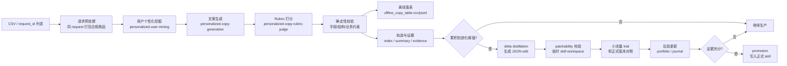
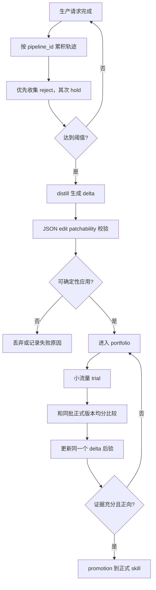

# VIP COPY

> 面向电商推荐场景的个性化文案生产、评估与自进化 harness。

VIP COPY 把一次曝光请求中的合规商品整体打包处理，让系统在同一个用户、同一次
`request_id` 上完成用户画像挖掘、推荐文案生成、自动评分、离线落表和小流量进化验证。

它适合这些场景：

- 🛒 给推荐列表里的多个商品批量生成个性化短文案
- 📊 离线评估文案质量、失败原因和 token 消耗
- 🧪 小流量验证新的 prompt/skill 改动是否真的提升效果
- 🔁 在长周期生产任务中积累轨迹，让系统逐步改进
- 🧾 产出可直接下游使用的离线表：`request_id,user_id,item_id,copy`

---

## 目录

- [快速开始](#快速开始)
- [VIP COPY 能做什么](#vip-copy-能做什么)
- [系统流程](#系统流程)
- [安装与环境](#安装与环境)
- [启动脚本](#启动脚本)
- [输入与输出](#输入与输出)
- [验证样例](#验证样例)
- [进化机制](#进化机制)
- [断点续传与产物管理](#断点续传与产物管理)
- [常用参数](#常用参数)
- [项目结构](#项目结构)

---

## 快速开始

```bash
git clone https://github.com/AI3-GenAI4Sci/Copy_harness.git
cd Copy_harness

bash scripts/install.sh
```

创建 `.env.local`：

```bash
DEEPSEEK_API_KEY=sk-...
DEEPSEEK_MODEL=deepseek-v4-pro
```

跑一个 15 条 request / 3 并发的小批量：

```bash
bash scripts/run_quick.sh
```

跑一个 50 条 request / 10 并发的 canary：

```bash
bash scripts/run_canary.sh
```

中断后继续同一个产物目录：

```bash
bash scripts/resume.sh .runs/starter_small_20260606T120000Z
```

---

## VIP COPY 能做什么

| 能力 | 说明 | 用户拿到什么 |
|---|---|---|
| 请求级多商品处理 | 一个 `request_id` 是一次曝光请求，同请求内多个合规商品一起进入链路 | 保持用户上下文一致，避免逐商品割裂 |
| 用户个性化挖掘 | 从用户历史、偏好、行为信号里提炼稳定文案因子 | 可解释的用户动机、场景、表达钩子 |
| 推荐短文案生成 | 为合规商品生成候选推荐文案 | 多条短 copy，绑定商品事实和用户因子 |
| 自动 rubric 评分 | LLM 只输出分数，harness 做确定性判断 | 可排序、可审查的文案质量信号 |
| 离线落表 | 最终只输出业务需要的四列文案表 | `request_id,user_id,item_id,copy` |
| 失败记录与重跑 | 失败 request 记录原因，主任务结束后可重试 | 不因局部失败阻塞整批任务 |
| 懒触发进化 | 累积足够轨迹后才分析失败/hold 案例 | 避免每条都进化造成 token 浪费 |
| 小流量 delta trial | 新 skill 改动先走 shadow/holdout 验证 | 只有证明正向后才可能 promotion |

---

## 系统流程



生产链路只有三个 LLM 节点：

1. `personalized-user-mining`：提炼用户动机、场景、偏好和表达钩子。
2. `personalized-copy-generation`：把用户因子和商品事实转成候选文案。
3. `personalized-copy-rubric-judge`：只输出结构化分数。

工程判断、重试、断点续传、delta 应用、trial 选择、后验更新和最终落表都由 harness
确定性完成。

---

## 安装与环境

### 运行要求

| 类型 | 要求 |
|---|---|
| Python | 3.11+ |
| LLM Provider | DeepSeek OpenAI-compatible API |
| 运行依赖 | 见 `requirements.txt` |
| 推荐系统 | macOS / Linux |

手动安装：

```bash
python3 -m venv .venv
source .venv/bin/activate
pip install -r requirements.txt
pip install -e .
```

验证入口：

```bash
vip-copy --help
python -m seers_harness.validation.runner --help
```

### `.env.local` 示例

```bash
DEEPSEEK_API_KEY=sk-...
DEEPSEEK_MODEL=deepseek-v4-pro
DEEPSEEK_TIMEOUT_SECONDS=300
DEEPSEEK_CALL_DEADLINE_SECONDS=300
DEEPSEEK_MAX_INFLIGHT_CALLS=10
```

默认推理强度为 `xhigh`，默认单次调用 timeout 和 streaming deadline 均为 `300s`。

---

## 启动脚本

脚本都在 `scripts/` 下，默认读取 `.env.local`。你可以用环境变量覆盖默认值。

| 脚本 | 用途 | 默认规模 |
|---|---|---|
| `scripts/install.sh` | 创建 `.venv` 并安装依赖 | - |
| `scripts/run_quick.sh` | 快速真实链路验证 | 15 request / 3 并发 |
| `scripts/run_canary.sh` | 常用 canary 批量 | 50 request / 10 并发 |
| `scripts/resume.sh` | 断点续传已有 `out_dir` | 从 manifest 尽量自动读取 |
| `scripts/run_large_template.sh` | 大规模压测模板 | 1,000,000 request / 50 并发 |

常见覆盖方式：

```bash
# 指定输出目录
OUT_DIR=.runs/my_canary bash scripts/run_canary.sh

# 临时提高 provider 并发
MAX_INFLIGHT_CALLS=20 bash scripts/run_canary.sh

# 只跑指定 request
REQUEST_IDS="-6834635816105165003 -6834636343439087307" bash scripts/run_quick.sh

# 共享长期进化状态
STATE_DIR=.runs/vip_copy_evolution_state bash scripts/run_canary.sh
```

百万级模板带防误触保护，需要显式确认：

```bash
CONFIRM_LARGE=1 bash scripts/run_large_template.sh
```

---

## 输入与输出

### 输入

默认从本地 `data_100k.csv` 读取请求数据。你也可以传入自定义 CSV：

```bash
vip-copy \
  --env-file .env.local \
  --csv path/to/data.csv \
  --num-requests 50 \
  --concurrency 10
```

关键约定：

- `request_id` 是一次曝光请求的金标准 key。
- 同一个 `request_id` 下的商品属于同一个用户和同一次曝光上下文。
- 一个请求里可能有多个合规商品，合规商品会一起进入文案生成节点。
- 同一个 `user_id` 的用户挖掘结果可被缓存复用。

### 最终业务表

最终离线表只保留业务需要的四列：

```text
request_id,user_id,item_id,copy
```

示例：

| request_id | user_id | item_id | copy |
|---|---:|---:|---|
| -6834635848893206135 | 140921217 | 6920832287677502793 | 含胸驼背改善体态 高口碑款 |
| -6833791596394007611 | 222884073 | 6921304807236403737 | 度假约会必备！清新气息持久留香 |
| -6834425217442237829 | 4698252 | 6921266932685931864 | 春季通勤不怕晒！敏感肌专属高倍防晒 |
| -6834706508028200887 | 568296523 | 6920366473311795356 | 按压式高口碑，全家刷牙更方便 |

### 运行产物

每次 runner 都拥有独立目录：

```text
.runs/<run_id>/
├── run_manifest.json
├── completed_records.jsonl
├── index.json
├── batch_summary.json
├── failed_requests.json
├── offline_copy_table.csv
├── offline_copy_table.jsonl
├── portfolio.jsonl
├── portfolio_journal.jsonl
├── _evolution_distill/
├── _trial_skill_workspaces/
└── <request_id 或 trial_execution_id>/
    ├── _artifacts/
    ├── evidence/
    ├── request_factor_copy_index.json
    └── evolution_snapshot.json
```

| 文件 | 用途 |
|---|---|
| `offline_copy_table.csv/jsonl` | 下游使用的离线文案表 |
| `run_manifest.json` | 本次运行配置、request 列表、provider 参数 |
| `completed_records.jsonl` | 断点续传依据 |
| `index.json` | 请求级索引和校验结果 |
| `batch_summary.json` | 批量通过率、失败类型、进化指标 |
| `failed_requests.json` | 最终失败 request 与原因 |
| `portfolio.jsonl` | 当前 delta portfolio 快照 |
| `portfolio_journal.jsonl` | 本次 trial 后验更新记录 |

---

## 验证样例

以下结果来自真实 DeepSeek 外发验证，用来说明系统功能和产物形态。

| 批次 | 规模 | 并发 | 状态 | 生产 records | trial records | 确定性校验 | 失败类别 | 离线 copy 行 |
|---|---:|---:|---|---:|---:|---|---|---:|
| 小批量链路验证 | 3 requests | 2 | PASSED | 3 | 0 | VAL-01/02/04 全通过 | ok=3 | 5 |
| 生产 canary 验证 | 50 requests | 10 | PASSED | 45 | 5 | VAL-01/02/04 全通过 | ok=50 | 68 |

生产 canary 的可读指标：

| 指标 | 数值 | 含义 |
|---|---:|---|
| `user_factor_count_p50` | 2.5 | 单请求用户因子中位数 |
| `copy_candidate_count_p50` | 2.0 | 单请求候选文案中位数 |
| `user_factor_diversity_score` | 0.8437 | 用户因子表达多样性 |
| `json_completion_when_underspec_rate` | 1.0 | 欠规格输入下 JSON 完成率 |
| `trial_belief_update_count` | 4 | 本批次完成的 delta 后验更新数 |

一个实际 delta 案例：

| 字段 | 示例 |
|---|---|
| 目标 skill | `personalized-copy-generation` |
| 操作 | `modify` |
| 观察 | 多条 reject/hold 轨迹显示文案场景质感弱，常只堆叠“高口碑/大牌”等抽象属性 |
| 改动 | 在文案方法中加入更明确的场景质感要求 |
| 状态 | experimental，继续通过 trial 后验更新判断是否 promotion |

---

## 进化机制

VIP COPY 的进化采用懒触发。系统先按并发管线累积轨迹，再在有足够 reject/hold
案例时做一次集中分析：



设计要点：

- 各并发 pipeline 独立累计触发阈值。
- delta 的后验按 canonical delta id 共享，多个并发 slot 测到同一个 delta 会共同更新。
- trial 使用真实请求的小比例流量，让 delta 在接近生产的流量里验证。
- 新 delta 先在临时 skill workspace 生效，不直接改正式 skill。
- 只有后验显示“比未使用 delta 的正式版本均分更好”并达到证据要求后，才进入 promotion。

---

## 断点续传与产物管理

默认情况下，每次运行的 `out_dir` 都是独立产物目录。如果目录非空且未传 `--resume`，
runner 会拒绝继续写入，避免新实验误借用旧产物。

```bash
vip-copy \
  --env-file .env.local \
  --out-dir .runs/canary \
  --num-requests 50 \
  --concurrency 10

vip-copy \
  --env-file .env.local \
  --out-dir .runs/canary \
  --resume
```

如果希望跨 runner 保留已经验证过的进化记忆，显式指定共享 `state_dir`：

```bash
vip-copy \
  --env-file .env.local \
  --out-dir .runs/batch_001 \
  --state-dir .runs/vip_copy_evolution_state \
  --num-requests 500 \
  --concurrency 50
```

这样每次 run 的证据目录仍然隔离，delta portfolio 和 journal 可以持续积累。

---

## 常用参数

| 参数 | 默认值 | 含义 | 调参影响 |
|---|---:|---|---|
| `--num-requests` | 15 | 本次运行多少个 request slot | 越大指标越稳定，耗时和 token 成本越高 |
| `--request-id` | 无 | 指定单个 request，可重复传入 | 适合排查具体案例；传入后通常不再依赖 `--num-requests` |
| `--concurrency` | 3 | 同时运行多少条请求管线 | 越大吞吐越高，也更容易触发 provider 限流 |
| `--timeout` | 300 | provider SDK/read timeout | 推理模型较慢时需要更高；过低会增加中断失败 |
| `--call-deadline` | 300 | 单次流式调用墙钟 deadline | 控制单次 LLM 调用最长等待时间 |
| `--max-inflight-calls` | 20 | 全局同时外发 API 调用上限 | 通常设为不超过 provider 配额；低于并发会主动削峰 |
| `--node-max-attempts` | 3 | 每个生产节点 JSON 输出重试次数 | 越大越能吸收偶发格式失败，也会增加坏样本成本 |
| `--trial-budget-fraction` | 0.02 | 每个 wave 分给 delta trial 的流量比例 | 越大进化反馈越快，但生产基线流量会减少 |
| `--distill-min-trajectories` | 派生 | 单 pipeline 触发进化分析的轨迹阈值 | 越大分析更稳，进化更新更慢；越小反馈更快但噪声更高 |
| `--state-dir` | `--out-dir` | delta portfolio / journal 存放位置 | 指向共享目录可跨 run 积累进化状态 |
| `--resume` | false | 从 `completed_records.jsonl` 断点续传 | 用于同一个 `out_dir` 的中断恢复 |
| `--no-distill` | false | 关闭本次运行的进化分析 | 适合只验证生产 DAG 或控制 token 成本 |

常用环境变量：

| 环境变量 | 默认值 | 说明 |
|---|---:|---|
| `DEEPSEEK_API_KEY` | 必填 | DeepSeek API key |
| `DEEPSEEK_MODEL` | `deepseek-v4-pro` | 模型名 |
| `DEEPSEEK_TIMEOUT_SECONDS` | 300 | SDK/read timeout |
| `DEEPSEEK_CALL_DEADLINE_SECONDS` | 300 | streaming deadline |
| `DEEPSEEK_MAX_INFLIGHT_CALLS` | 20 | 最大同时外发调用 |
| `VIP_COPY_NODE_MAX_ATTEMPTS` | 3 | 节点 JSON 输出重试次数 |
| `VIP_COPY_TRIAL_BUDGET_FRACTION` | 0.02 | trial 流量比例 |
| `VIP_COPY_PROMOTION_MIN_READY` | 3 | 至少多少个 ready delta 才允许 promotion |
| `VIP_COPY_TRIAL_RNG_SEED` | 未设置 | 固定 trial 随机种子，便于复盘 |

---

## 项目结构

```text
.
├── seers_harness/
│   ├── agentic/            # LLM JSON mode 与工具循环基础设施
│   ├── domain/             # 结构化产物模型
│   ├── evolution/          # delta、trial、后验、promotion
│   ├── intake/             # CSV/request 预处理
│   ├── provider_runtime/   # DeepSeek/OpenAI-compatible runtime
│   ├── validation/         # runner、dashboard、落表、摘要
│   └── workflow/           # DAG 节点运行与 skill 加载
├── workflow-skills/
│   ├── current/            # 生产 skills
│   └── evolution/          # 进化 distillation skill
├── scripts/                # 快速启动脚本
├── requirements.txt        # 运行依赖
├── pyproject.toml
└── README.md
```

---

## 推荐上线节奏

```bash
# 1. 小批量真实链路
bash scripts/run_quick.sh

# 2. 常用 canary
bash scripts/run_canary.sh

# 3. 50 并发中等压测
NUM_REQUESTS=500 CONCURRENCY=50 MAX_INFLIGHT_CALLS=50 bash scripts/run_canary.sh

# 4. 百万级离线压测
CONFIRM_LARGE=1 bash scripts/run_large_template.sh
```

当前版本已经通过小批量真实外发、50 request / 10 并发真实批量和全量单测验证，
适合进入更大规模的离线压测与灰度实验。
