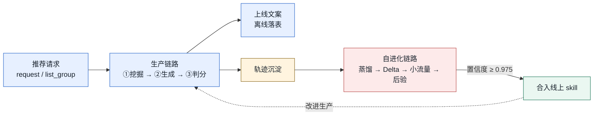
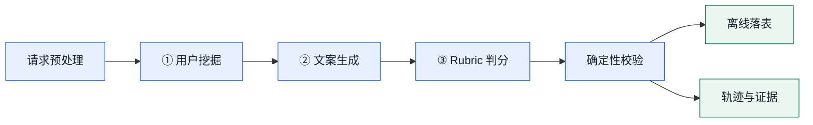
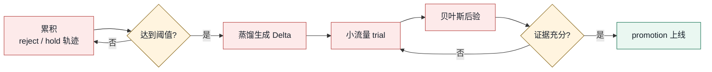

# VIP COPY

> 面向电商推荐场景的个性化文案 **生产 · 评估 · 自进化** harness。

VIP COPY 把一次曝光请求里的合规商品整体打包，在同一个用户、同一个 `request_id` 上
依次完成**用户画像挖掘 → 推荐文案生成 → 自动评分 → 离线落表**；并在长周期生产中
沉淀轨迹，让系统按贝叶斯证据**自我改进文案技能**。

它适合这些场景：

- 🛒 给推荐列表里的多个商品**批量生成**个性化短文案
- 📊 **离线评估**文案质量、失败原因和 token 消耗
- 🧪 **小流量验证**新的 prompt/skill 改动是否真的提升效果
- 🔁 在长周期任务中**积累轨迹**，让系统逐步改进
- 🧾 产出可直接下游使用的离线表：`request_id,user_id,item_id,copy`



<sub>🏭 蓝色：生产链路 ｜ 🔗 黄色：轨迹（两条链路的桥） ｜ 🔁 红色：自进化链路 ｜ ✅ 绿色：晋升上线</sub>

---

## 目录

- [核心概念](#核心概念)
- [快速开始](#快速开始)
- [系统流程](#系统流程)
- [能力一览](#能力一览)
- [安装与环境](#安装与环境)
- [启动脚本](#启动脚本)
- [输入与输出](#输入与输出)
- [进化机制](#进化机制)
- [验证样例](#验证样例)
- [断点续传与产物管理](#断点续传与产物管理)
- [常用参数](#常用参数)
- [项目结构](#项目结构)
- [推荐上线节奏](#推荐上线节奏)
- [延伸阅读](#延伸阅读)

---

## 核心概念

读懂 VIP COPY 只需要先记住五个词：

| 概念 | 一句话 |
|---|---|
| 🧩 `request/list_group` | 个性化的**最小语义单元**：一次曝光请求 = 一个用户 + 一组合规商品 |
| 🏭 三节点生产 DAG | `用户挖掘 → 文案生成 → Rubric 判分`，全部 JSON mode、**不使用工具** |
| 🔗 轨迹 | 每条请求留下一条完整轨迹，是进化的**唯一原料** |
| 🔁 Delta 补丁 | 针对某个 skill **单一机制**的可执行 edit（精确 `find` / `replace`） |
| ✅ 后验晋升 | Beta-Bernoulli 后验**置信度 ≥ 0.975** 才把 delta 合入线上 |

> 🔑 **分工**：LLM 只负责**生成内容和打分**；工程判断、重试、断点续传、delta 应用、
> trial 选择、后验更新和最终落表，全部由 harness **确定性**完成。

系统恪守几条不变量，读 README 时不妨先记住：

- 📌 文案**不含任何用户历史 token**——因子表达的是可复用的用户动机，而非 token 桥。
- 📌 **没有 LLM 自评分字段**——评分只产出结构化分数，准入由 harness 判定。
- 📌 一次 intake 只处理**一个** `request/list_group`。
- 📌 当前生成范围限定五个三级类目：`防晒霜/乳`、`牙膏/牙粉`、`维生素`、`香水`、`护肩`。

---

## 快速开始

```bash
git clone https://github.com/AI3-GenAI4Sci/VIP_Copy.git
cd VIP_Copy

bash scripts/install.sh
```

创建 `.env.local`：

```bash
DEEPSEEK_API_KEY=sk-...
DEEPSEEK_MODEL=deepseek-v4-pro
```

| 想做什么 | 命令 |
|---|---|
| 🧪 跑小批量真实链路（15 request / 3 并发） | `bash scripts/run_quick.sh` |
| 🚦 跑生产 canary（50 request / 10 并发） | `bash scripts/run_canary.sh` |
| ♻️ 中断后续跑同一产物目录 | `bash scripts/resume.sh .runs/<run_id>` |

> ⚙️ 三个脚本都默认读取 `.env.local`，产物写到 `.runs/<run_id>/`。所有规模都可用
> 环境变量覆盖，详见[启动脚本](#启动脚本)。

---

## 系统流程

生产链路只有**三个 LLM 节点**，其余全部是确定性 harness 逻辑：



| 节点 | skill | 职责 | 产出 |
|---|---|---|---|
| ① | `personalized-user-mining` | 从用户历史/偏好/行为信号提炼动机 | 可解释的用户因子（动机、场景、表达钩子） |
| ② | `personalized-copy-generation` | 把用户因子 × 商品事实转成文案 | 多条候选短 copy，绑定商品与因子 |
| ③ | `personalized-copy-rubric-judge` | 只输出结构化分数 | 可排序、可审查的质量信号 |

---

## 能力一览

| 能力 | 说明 | 用户拿到什么 |
|---|---|---|
| 🧩 请求级多商品处理 | 一个 `request_id` 是一次曝光请求，同请求内多个合规商品一起进链路 | 保持用户上下文一致，避免逐商品割裂 |
| 🔍 用户个性化挖掘 | 从历史、偏好、行为信号里提炼稳定文案因子 | 可解释的用户动机、场景、表达钩子 |
| ✍️ 推荐短文案生成 | 为合规商品生成候选推荐文案 | 多条短 copy，绑定商品事实与用户因子 |
| ⚖️ 自动 rubric 评分 | LLM 只输出分数，harness 做确定性判断 | 可排序、可审查的文案质量信号 |
| 🧾 离线落表 | 最终只输出业务需要的四列文案表 | `request_id,user_id,item_id,copy` |
| 🔁 失败记录与重跑 | 失败 request 记录原因，主任务结束后可重试 | 不因局部失败阻塞整批任务 |
| 🐢 懒触发进化 | 累积足够轨迹后才分析失败/hold 案例 | 避免每条都进化造成 token 浪费 |
| 🧪 小流量 delta trial | 新 skill 改动先走 shadow/holdout 验证 | 只有证明正向后才可能 promotion |

---

## 安装与环境

### 运行要求

| 类型 | 要求 |
|---|---|
| 🐍 Python | 3.11+ |
| 🤖 LLM Provider | DeepSeek OpenAI-compatible API |
| 📦 运行依赖 | 见 `requirements.txt` |
| 💻 推荐系统 | macOS / Linux |

手动安装（等价于 `scripts/install.sh`）：

```bash
python3 -m venv .venv
source .venv/bin/activate
pip install -r requirements.txt
pip install -e .
```

验证入口：

```bash
vip-copy --help
python -m seers_harness.validation.runner --help
```

### `.env.local` 示例

```bash
DEEPSEEK_API_KEY=sk-...
DEEPSEEK_MODEL=deepseek-v4-pro
DEEPSEEK_TIMEOUT_SECONDS=300
DEEPSEEK_CALL_DEADLINE_SECONDS=300
DEEPSEEK_MAX_INFLIGHT_CALLS=20
```

> ⚙️ 默认推理强度为 `xhigh`，默认单次调用 timeout 与 streaming deadline 均为 `300s`。

---

## 启动脚本

脚本都在 `scripts/` 下，默认读取 `.env.local`，可用环境变量覆盖默认值。

| 脚本 | 用途 | 默认规模 |
|---|---|---|
| `install.sh` | 创建 `.venv` 并安装依赖 | — |
| `run_quick.sh` | 快速真实链路验证 | 15 request / 3 并发 |
| `run_canary.sh` | 常用 canary 批量 | 50 request / 10 并发 |
| `resume.sh` | 断点续传已有 `out_dir` | 自动从 `run_manifest.json` 读取规模 |
| `run_large_template.sh` | 大规模压测模板 | 1,000,000 request / 50 并发 |

常见覆盖方式：

```bash
# 指定输出目录
OUT_DIR=.runs/my_canary bash scripts/run_canary.sh

# 临时提高 provider 并发
MAX_INFLIGHT_CALLS=20 bash scripts/run_canary.sh

# 只跑指定 request
REQUEST_IDS="-6834635816105165003 -6834636343439087307" bash scripts/run_quick.sh

# 跨 run 共享长期进化状态
STATE_DIR=.runs/vip_copy_evolution_state bash scripts/run_canary.sh
```

> ⚠️ 百万级模板带防误触保护，需显式确认：
> `CONFIRM_LARGE=1 bash scripts/run_large_template.sh`

---

## 输入与输出

### 📥 输入

默认从本地 `data_100k.csv` 读取，也可传入自定义 CSV：

```bash
vip-copy \
  --env-file .env.local \
  --csv path/to/data.csv \
  --num-requests 50 \
  --concurrency 10
```

> 📌 **关键约定**
> - `request_id` 是一次曝光请求的金标准 key。
> - 同一 `request_id` 下的商品属于**同一用户、同一次曝光上下文**。
> - 一个请求里可能有多个合规商品，它们一起进入文案生成节点。
> - 同一 `user_id` 的用户挖掘结果可被缓存复用。

### 📤 最终业务表

最终离线表只保留业务需要的四列 `request_id,user_id,item_id,copy`：

| request_id | user_id | item_id | copy |
|---|---:|---:|---|
| -6834635848893206135 | 140921217 | 6920832287677502793 | 含胸驼背改善体态 高口碑款 |
| -6833791596394007611 | 222884073 | 6921304807236403737 | 度假约会必备！清新气息持久留香 |
| -6834425217442237829 | 4698252 | 6921266932685931864 | 春季通勤不怕晒！敏感肌专属高倍防晒 |
| -6834706508028200887 | 568296523 | 6920366473311795356 | 按压式高口碑，全家刷牙更方便 |

### 🗂️ 运行产物

每次 runner 都独占一个产物目录：

```text
.runs/<run_id>/
├── run_manifest.json          # 本次配置 / request 列表 / provider 参数
├── completed_records.jsonl    # 断点续传依据
├── index.json                 # 请求级索引与校验结果
├── batch_summary.json         # 通过率 / 失败类型 / 进化指标
├── failed_requests.json       # 最终失败 request 与原因
├── offline_copy_table.csv     # ← 下游使用的离线文案表
├── offline_copy_table.jsonl
├── portfolio.jsonl            # 当前 delta portfolio 快照
├── portfolio_journal.jsonl    # 本次 trial 后验更新记录
├── _evolution_distill/
├── _trial_skill_workspaces/
└── <request_id 或 trial_execution_id>/
    ├── _artifacts/
    ├── evidence/
    ├── request_factor_copy_index.json
    └── evolution_snapshot.json
```

---

## 进化机制

VIP COPY 的进化是**懒触发**：系统先按并发管线累积轨迹，等攒够 reject/hold 案例
再做一次集中分析，避免每条请求都进化造成 token 浪费。



> 🔑 **设计要点**
> - 各并发 pipeline **独立**累计触发阈值。
> - delta 后验按 canonical delta id **共享**——多个并发 slot 测到同一个 delta 会共同更新。
> - trial 用真实请求的**小比例流量**，让 delta 在接近生产的环境里验证。
> - 新 delta 先在**临时 skill workspace** 生效，不直接动正式 skill。
> - 只有后验显示「比未用 delta 的正式版本均分更好」且达到证据门槛，才进入 promotion，
>   并带 sha256 归档与回滚。

想看一条完整的进化链路（从失败轨迹到贝叶斯晋升判定），见
**[案例详解](docs/system-walkthrough.md)** 的 Part Ⅱ。

---

## 验证样例

以下结果来自真实 DeepSeek 外发验证，用来说明系统功能和产物形态。

> 📖 想看一次请求如何端到端走通**生产 + 自进化**两条链路？读
> **[案例详解：从一次推荐请求到一条自进化补丁](docs/system-walkthrough.md)**——
> 全部输入、用户因子、评分与 delta 补丁都取自同一次真实运行，可逐项复核。

| 批次 | 规模 | 并发 | 状态 | 生产 records | trial records | 确定性校验 | 失败类别 | 离线 copy 行 |
|---|---:|---:|:--:|---:|---:|---|---|---:|
| 小批量链路验证 | 3 | 2 | ✅ PASSED | 3 | 0 | VAL-01/02/04 全通过 | ok=3 | 5 |
| 生产 canary 验证 | 50 | 10 | ✅ PASSED | 45 | 5 | VAL-01/02/04 全通过 | ok=50 | 68 |

生产 canary 的可读指标：

| 指标 | 数值 | 含义 |
|---|---:|---|
| `user_factor_count_p50` | 2.5 | 单请求用户因子中位数 |
| `copy_candidate_count_p50` | 2.0 | 单请求候选文案中位数 |
| `user_factor_diversity_score` | 0.8437 | 用户因子表达多样性 |
| `json_completion_when_underspec_rate` | 1.0 | 欠规格输入下 JSON 完成率 |
| `trial_belief_update_count` | 4 | 本批次完成的 delta 后验更新数 |

一个实际 delta 案例：

| 字段 | 内容 |
|---|---|
| 🎯 目标 skill | `personalized-copy-generation` |
| 🛠️ 操作 | `modify` |
| 👀 观察 | 多条 reject/hold 轨迹显示文案场景质感弱，常只堆叠「高口碑/大牌」等抽象属性 |
| ✏️ 改动 | 在文案方法中加入更明确的场景质感要求 |
| 📌 状态 | `experimental`——继续通过 trial 后验更新判断是否 promotion |

---

## 断点续传与产物管理

默认情况下，每次运行的 `out_dir` 都是独立产物目录。若目录非空且未传 `--resume`，
runner 会**拒绝写入**，避免新实验误借用旧产物。

```bash
# 首次运行
vip-copy --env-file .env.local --out-dir .runs/canary \
  --num-requests 50 --concurrency 10

# 中断后续跑同一目录
vip-copy --env-file .env.local --out-dir .runs/canary --resume
```

若希望跨 runner 保留已验证的进化记忆，显式指定共享 `state_dir`：

```bash
vip-copy --env-file .env.local \
  --out-dir .runs/batch_001 \
  --state-dir .runs/vip_copy_evolution_state \
  --num-requests 500 --concurrency 50
```

> 📌 这样每次 run 的证据目录仍然隔离，而 delta portfolio 和 journal 可以持续积累。

---

## 常用参数

| 参数 | 默认值 | 含义 | 调参影响 |
|---|---:|---|---|
| `--num-requests` | 15 | 本次运行多少个 request slot | 越大指标越稳，耗时和 token 成本越高 |
| `--request-id` | 无 | 指定单个 request，可重复传入 | 适合排查具体案例；传入后通常不再依赖 `--num-requests` |
| `--concurrency` | 3 | 同时运行多少条请求管线 | 越大吞吐越高，也更易触发 provider 限流 |
| `--timeout` | 300 | provider SDK/read timeout | 推理模型较慢时需调高；过低会增加中断失败 |
| `--call-deadline` | 300 | 单次流式调用墙钟 deadline | 控制单次 LLM 调用最长等待时间 |
| `--max-inflight-calls` | 20 | 全局同时外发 API 调用上限 | 通常设为不超过 provider 配额；低于并发会主动削峰 |
| `--node-max-attempts` | 3 | 每个生产节点 JSON 输出重试次数 | 越大越能吸收偶发格式失败，也会增加坏样本成本 |
| `--trial-budget-fraction` | 0.02 | 每个 wave 分给 delta trial 的流量比例 | 越大进化反馈越快，但生产基线流量会减少 |
| `--distill-min-trajectories` | 派生 | 单 pipeline 触发进化分析的轨迹阈值 | 越大分析更稳、进化更慢；越小反馈更快但噪声更高 |
| `--state-dir` | `--out-dir` | delta portfolio / journal 存放位置 | 指向共享目录可跨 run 积累进化状态 |
| `--resume` | false | 从 `completed_records.jsonl` 断点续传 | 用于同一 `out_dir` 的中断恢复 |
| `--no-distill` | false | 关闭本次运行的进化分析 | 适合只验证生产 DAG 或控制 token 成本 |

常用环境变量：

| 环境变量 | 默认值 | 说明 |
|---|---:|---|
| `DEEPSEEK_API_KEY` | 必填 | DeepSeek API key |
| `DEEPSEEK_MODEL` | `deepseek-v4-pro` | 模型名 |
| `DEEPSEEK_TIMEOUT_SECONDS` | 300 | SDK/read timeout |
| `DEEPSEEK_CALL_DEADLINE_SECONDS` | 300 | streaming deadline |
| `DEEPSEEK_MAX_INFLIGHT_CALLS` | 20 | 最大同时外发调用 |
| `VIP_COPY_NODE_MAX_ATTEMPTS` | 3 | 节点 JSON 输出重试次数 |
| `VIP_COPY_TRIAL_BUDGET_FRACTION` | 0.02 | trial 流量比例 |
| `VIP_COPY_PROMOTION_MIN_READY` | 3 | 至少多少个 ready delta 才允许 promotion |
| `VIP_COPY_TRIAL_RNG_SEED` | 未设置 | 固定 trial 随机种子，便于复盘 |

---

## 项目结构

```text
.
├── seers_harness/
│   ├── agentic/            # LLM JSON mode 与工具循环基础设施
│   ├── core/               # 共享基础类型与工具
│   ├── domain/             # 结构化产物模型
│   ├── evolution/          # delta、trial、后验、promotion
│   ├── intake/             # CSV / request 预处理
│   ├── provider_runtime/   # DeepSeek / OpenAI-compatible runtime
│   ├── tools/              # 进化 skill 的工具接口
│   ├── validation/         # runner、dashboard、落表、摘要
│   └── workflow/           # DAG 节点运行与 skill 加载
├── workflow-skills/
│   ├── current/            # 生产 skills（三节点）
│   └── evolution/          # 进化 distillation skill
├── scripts/                # 快速启动脚本
├── docs/                   # 设计、案例、评分标准等文档
├── data_100k.csv           # 默认输入数据
├── requirements.txt
├── pyproject.toml
└── README.md
```

---

## 推荐上线节奏

```bash
# 1. 小批量真实链路
bash scripts/run_quick.sh

# 2. 常用 canary
bash scripts/run_canary.sh

# 3. 50 并发中等压测
NUM_REQUESTS=500 CONCURRENCY=50 MAX_INFLIGHT_CALLS=50 bash scripts/run_canary.sh

# 4. 百万级离线压测
CONFIRM_LARGE=1 bash scripts/run_large_template.sh
```

> ✅ 当前版本已通过小批量真实外发、50 request / 10 并发真实批量和全量单测验证，
> 适合进入更大规模的离线压测与灰度实验。

---

## 延伸阅读

📖 **[案例详解：从一次推荐请求到一条自进化补丁](docs/system-walkthrough.md)**

用一次真实的生产批量运行，把系统的两条链路完整走一遍：

- **🏭 生产链路**：一次推荐请求如何被三个模型节点加工成可上线文案。
- **🔁 自进化链路**：系统如何从生产轨迹中发现机制弱点，并用贝叶斯证据决定是否合入线上技能。

文中所有输入、用户因子、评分与补丁都取自同一次运行，可逐项复核。
