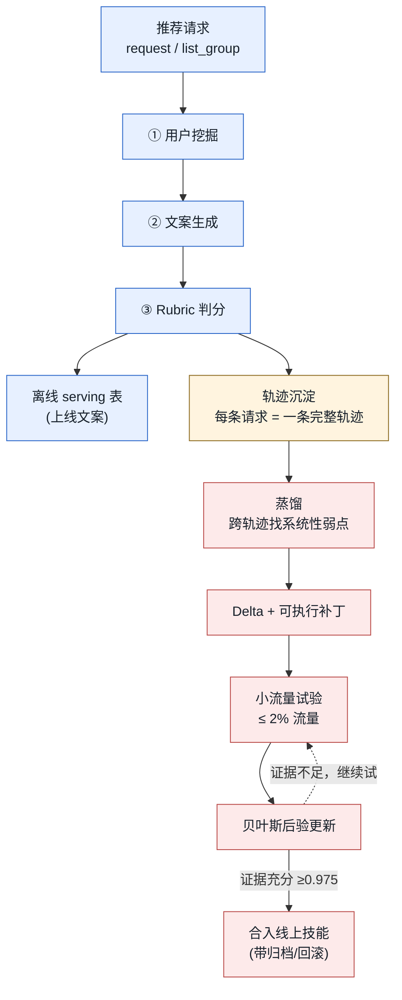
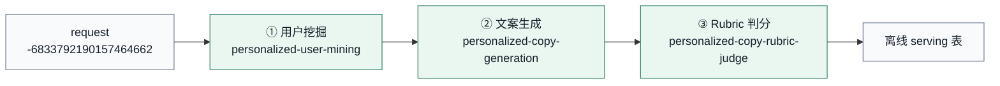
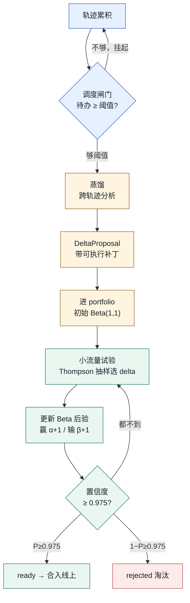
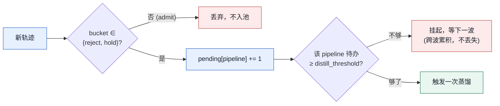
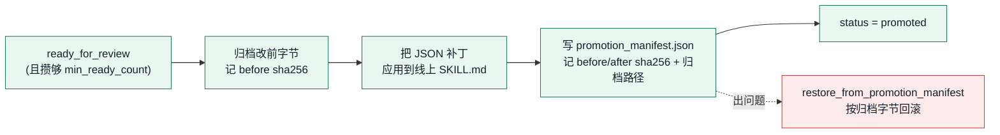

# VIP COPY 系统案例详解：从一次推荐请求到一条自进化补丁

本文用一次真实的生产批量运行，把 VIP COPY 的两条链路完整走一遍：

- **🏭 生产链路**：一次推荐请求如何被三个模型节点加工成可上线文案。
- **🔁 自进化链路**：系统如何从生产轨迹中发现自身机制弱点，并用贝叶斯证据决定是否把改动合入线上技能。

文中所有输入、输出、分数与补丁均取自同一次运行（`.runs/vip_copy_prod_retest_50x10_20260606/`），可按[附录 B](#附录-b真实文件索引) 的文件索引逐项复核。

跟踪的请求是 `-6833792190157464662`——一位 38 岁、一线城市、金卡会员的女性用户。挖掘节点为她拆出 **3 条**购买动机线，文案节点最终只为其中 **1 条**产出 **2 条**可上线文案。

---

## 全景：一次请求如何驱动两条链路



| 部分 | 章节 | 回答的问题 |
|---|---|---|
| 🏭 **Ⅰ 生产链路** | §1–§4 | 一次请求如何变成上线文案？ |
| 🔁 **Ⅱ 自进化链路** | §5–§10 | 系统如何发现并修正自己的弱点？ |
| 🔗 **串联** | §11 | 两条链路如何相互喂养？ |

---

## Ⅰ · 生产链路

> 生产链路尽量讲得紧凑——它是后半部分真正想讲清楚的自进化机制的"原料车间"。

### 1 处理单元与三节点

系统的最小处理单元不是"一个用户"或"一条商品"，而是 **request / list_group**——一次推荐请求里属于同一列表坑位组的那批商品。一条请求进来，三个节点接力把它加工成可上线短文案：



| # | 节点 | 输入 | 输出 | tokens（含 reasoning） |
|---|---|---|---|---|
| ① | 用户挖掘 | 用户画像 + 行为信号 | 用户因子 × 3 | 4,391（1,349） |
| ② | 文案生成 | 用户因子 + 商品事实 | 候选文案 × 2 | 6,074（2,097） |
| ③ | Rubric 判分 | 候选文案 + 上下文 | 逐条 judgment | 7,388（2,690） |

三个节点全部运行在 DeepSeek-v4-flash 的 **JSON mode**，**不调用任何工具**——每个节点只读上游 JSON、吐一份结构化 JSON。

> ⚙️ **设计要点** — "纯 JSON、无工具"是刻意选择：它让每个节点的输入输出都可存档、可重放、可逐字段归因。这一性质在第二部分会成为整条自进化链路的地基——没有干净的轨迹，就没有可信的蒸馏。

这条请求喂给节点 ① 的原始 payload 如下（`user_state_signals` 完整保留）：

```json
{
  "schema_version": "request_user_personalization_payload_v1",
  "request_id": "-6833792190157464662",
  "minimum_semantic_unit": "request/list_group",
  "user_state_summary": {
    "profile": {"gender": "女", "age": 38, "city_level": "一线城市", "vip_level": "金卡会员", "is_svip": 1}
  },
  "user_state_signals": {
    "profile_counts": {
      "register_days": 2705, "click_cnt_30d": 403, "order_cnt_30d": 13, "order_cnt_90d": 17,
      "purchase_price_avg_30d": 54.17, "fav_price_avg_30d": 0.0, "coupon_use_cnt_30d": 3,
      "cart_cnt_30d": 29, "fav_brand_cnt_30d": 1
    },
    "behavior_top_lists": {
      "prefer_cat3_topK": "运动休闲鞋(rank=1), 儿童内裤(rank=2), 婴幼套装(rank=3), 儿童运动鞋(rank=4), 家居拖鞋(rank=5), 男袜(rank=6), 婴幼裤子(rank=7), 儿童安全防护(rank=8), 跑步鞋(rank=9), 儿童板鞋/休闲鞋(rank=10)",
      "prefer_brand_topK": "安德玛(rank=1), 巴布豆(rank=2), 多嘻噜卡(rank=3), BOBDOG house(rank=4), 汪汪队立大功(rank=5), 猫人(rank=6), 精典泰迪(rank=7), 爱贝迪拉(rank=8), 乔丹(rank=9)",
      "seq_click_cat3_48h": "儿童内裤(4), 学步鞋(3), 女式羊毛衫(3), 家居拖鞋(3), 运动休闲鞋(3)",
      "seq_click_brand_48h": "汪汪队立大功(4), 巴布豆(4), 金菊(3), BOBDOG house(2), 361°(2)",
      "order_goods_id_list_topN": "【6条装】10A抗菌儿童内裤小男孩宝宝挖掘机男童平角小短裤(2), UA Phantom 365男女情侣运动休闲鞋【尺码偏小】(1), 儿童拖鞋洞洞鞋包头男孩女童宝宝卡通防撞包头鞋(1), 【提花轻薄】婴儿衣服夏季套装薄款纯棉七分套装空调服家居服潮(1), 纯棉男童内裤儿童男宝四角短裤中小孩大童宝宝小童男孩全棉(1)",
      "order_brand_id_list_topN": "巴布豆(2), 精典泰迪(2), 安德玛(1), 汪汪队立大功(1), 多嘻噜卡(1)",
      "order_cat3_id_list_topN": "儿童内裤(2), 婴幼裤子(2), 运动休闲鞋(1), 家居拖鞋(1), 婴幼套装(1)",
      "addcart_goods_id_list_topN": "【6条装】10A抗菌儿童内裤(3), 潮流时尚百搭休闲男女同款休闲鞋板鞋运动鞋(3), 巴布豆童鞋25夏季【镂空网面】轻便软底网面鞋男女童舒适运动鞋(3), 儿童拖鞋洞洞鞋(2), 女装【职场干练】春季显瘦高腰烟管裤女通勤百搭气质女式牛仔裤(2)",
      "addcart_brand_id_list_topN": "猫人(7), 汪汪队立大功(4), BOBDOG house(4), 巴布豆(3), 多嘻噜卡(3)",
      "addcart_cat3_id_list_topN": "儿童运动鞋(5), 男士保暖套装(5), 儿童内裤(4), 婴幼套装(4), 运动休闲鞋(4)",
      "collect_goods_id_list_topN": "Fresh 馥蕾诗大马士革玫瑰密集保湿面霜套装 50ml*2(1), 特卖【厚底增高】春秋季爆款老爹鞋男时尚百搭男鞋运动鞋男休闲鞋(1), 【好物推荐】时尚可脱卸帽艺术大师联名中长款保暖女式羽绒服(1)",
      "collect_brand_id_list_topN": "馥蕾诗(1), 汤姆•泰勒(1), 波司登(1)",
      "click_brand_id_list_topN": "安德玛(27), 巴布豆(9), 汪汪队立大功(8), 阿迪达斯(7), 多嘻噜卡(7)"
    }
  }
}
```

这堆信号是交织的。把它读成三股各自独立的购买意图，就是节点 ① 的工作：

| 信号线 | 证据（来自 `user_state_signals`） | 推断意图 |
|---|---|---|
| 👶 童装童鞋 | 订单 5 件中 4 件儿童相关；加购儿童运动鞋 ×5 | 为孩子高频补货 |
| 👟 运动鞋 | 点击安德玛 27 次、阿迪 7 次；订单含 UA 鞋 | 自用品牌运动鞋 |
| 💄 品质单品 | 收藏馥蕾诗面霜、波司登羽绒服、老爹鞋（均未下单） | 想买未决的品质消费 |

---

### 2 节点①：把信号拆成"用户因子"

用户挖掘节点把上面那团信号拆成一组 **用户因子（User Factor）**。每个因子是一条独立的购买动机线，结构固定为六个字段：

| 字段 | 含义 |
|---|---|
| `signal_basis` | 动机背后可见的行为信号 |
| `need_or_pain` | 可迁移的需求或痛点 |
| `scene_trigger` | 可能触发购买的使用场景 |
| `buying_heuristic` | 用户可能依赖的购买判断 |
| `expression_hooks` | 可用于文案的表达切入点 |

这一步的价值在于**拆得干净**：把上一节那三股交织的意图切成互不混淆的三条动机线，下游文案才不会写成"啥都沾一点"的万金油。本次真实输出：

| 因子 | 一句话动机 | 触发场景 | 表达钩子 | 下游产出 |
|---|---|---|---|---|
| **UF_001** 童装童鞋 | 为孩子选安全舒适的日常服饰鞋品，省心不踩雷 | 换季添衣 / 日常补货 / 夏季薄款 | 抗菌纯棉 · 卡通图案 · 多件装 | ✅ 2 条文案 |
| **UF_002** 运动鞋 | 自用百搭运动鞋，兼顾通勤与轻运动，重品牌品质 | 日常通勤 / 周末轻运动 / 换季购鞋 | 安德玛 · 百搭舒适 · 轻运动 | — 0 条 |
| **UF_003** 品质单品 | 改善肌肤与形象的品质单品，但决策长、需充分理由 | 换季护肤 / 气温下降 / 穿搭升级 | 保湿面霜 · 品质护肤 · 时尚羽绒服 | — 0 条 |

> 🔑 **关键机制** — UF_003 的 `signal_basis` 明确写了"**尚未转化为订单**"，`need_or_pain` 写了"**决策较长需充分理由**"。这是把"收藏了但没买"这一行为计数（`collect_goods_id_list`），翻译成"高决策门槛、需要给足理由"的动机判断。用户因子的存在意义，正是把冷计数变成下游能直接落笔的动机语言。

---

### 3 节点②：动机 × 商品事实 → 文案

文案节点的输入 = 上一步的三个用户因子 + 本次请求要承接的候选商品。本次只有一个候选——一款牙膏组合装：

| 商品事实 | 值 |
|---|---|
| 标题 | 【换牙期专研】6-12岁少儿牙膏\*2+成人牙膏20ml3支装 |
| 品类 / 品牌 | 牙膏/牙粉 · 艾美适（国内 B） |
| 到手价 / 标价 / 折扣 | ¥71 / ¥128 / 0.55 |
| 口碑 | `item_satisfy=1.0` · `review_cnt=4892` · 30 天退货率 `0.0` |
| 与用户匹配 | `cat3_alignment=mismatch` · `brand_alignment=mismatch`（从未买过此品类/品牌） |
| 派生信号 | `review_band=popular` · `ctr_band=high` · 价格"略高于"用户基线 |

这里有个现实难点：派生特征明确算出该商品与用户历史**双重 mismatch**（品类、品牌都没买过），但它**口碑极好**。模型要判断的是：在品类不匹配的情况下，能否从用户的某个因子里找到一个**还站得住的承接点**。

它选择了 UF_001（儿童相关动机），产出 2 条文案：

| 候选 | 文案 | 商业角度 | 承接因子 |
|---|---|---|---|
| **C_001** | 高口碑儿童牙膏，换牙期安心之选 | 口碑背书 + 痛点前置 | UF_001 |
| **C_002** | 换牙期专研，多支装更划算 | 场景痛点 + 价值感 | UF_001 |

UF_002（运动鞋）和 UF_003（护肤）的 `copies` 都是空数组——模型判断牙膏接不上这两条动机线，于是不为它们硬凑文案。每条产出的文案都带着两个审计字段，例如 C_001：

```text
product_binding: 通过"高口碑"露出满意度信号（review_band='popular'），
                 承接换牙期儿童对安全的痛点需求；选取理由：UF_001 注重材质与安全。
fact_binding:    item_satisfy=1.0，review_cnt=4892，review_band='popular'；标题含"换牙期专研"。
```

> ⚙️ **设计要点** — `product_binding`（承接路径）和 `fact_binding`（依赖的商品事实）不会出现在最终上线文案里，但它们记录了"文案凭什么这么写"。这两个字段是下游判分和归因的依据——也是后续蒸馏能精确定位机制弱点的前提。

---

### 4 节点③：判分、准入与成本

判分节点先对每条候选过 **5 道客观硬门**，全过之后再打 **7 个质量轴**（每轴 0–5 分，加总为 `total_score`，满分 35）。

本次两条候选的 5 道硬门**全部通过**（无隐私轨迹泄露、无具体数字、无复读商品名、商品价值可见、可直接发布）。七轴评分：

| 质量轴 | C_001 | C_002 | 诊断 |
|---|:---:|:---:|---|
| `motivation_fit` 动机贴合 | 4 | 3 | C_002 更侧重划算，安全传达稍弱 |
| `product_value` 商品价值 | 4 | 4 | 高口碑/组合装价值清晰 |
| `conversion_pull` 转化牵引 | 3 | 4 | C_002"更划算"直接刺激购买 |
| `copycraft` 文案表达 | 4 | 4 | 短句顺口、有节奏 |
| `distinctiveness` 差异性 | 4 | 3 | C_001 口碑角度更独特 |
| `scene_texture` 场景质感 | **3** ⚠️ | **2** ⚠️ | "画面较单薄" / "缺乏具体画面感" |
| `benefit_clarity` 利益清晰 | 4 | 4 | 一眼可知是儿童牙膏 |
| **总分** `total_score` | **26** | **24** | 满分 35 |

> ⚠️ **盯住这个细节** — 两条文案在 `scene_texture`（场景质感）上都偏低（3 分、2 分），其余各轴普遍 4 分。这条请求单独看是正常的，但它在这一轴上的低分，正是第二部分整条自进化链路要处理的那个**系统性弱点的一个样本**。

**准入与落表。** 决策（admit / hold / reject）不由判分模型输出，而由 harness 按确定性规则派生；离线导出层另设一道闸门：

> 📤 **导出口径** — 只要 5 道客观硬门全过、且 `total_score ≥ 21`，文案就进 serving 表（以总分为准，不看 admit/hold 标签）。

两条候选都满足，于是真实落进 `offline_copy_table.jsonl`：

```json
{"request_id": "-6833792190157464662", "user_id": "326162944", "item_id": "6919762505649513821", "copy": "高口碑儿童牙膏，换牙期安心之选"}
{"request_id": "-6833792190157464662", "user_id": "326162944", "item_id": "6919762505649513821", "copy": "换牙期专研，多支装更划算"}
```

（`user_id` 为平台侧数值哈希，文案不含任何用户私有 token。）

**本次请求三节点成本：**

| 节点 | total tokens | reasoning tokens | 模型 |
|---|---:|---:|---|
| ① 用户挖掘 | 4,391 | 1,349 | deepseek-v4-flash |
| ② 文案生成 | 6,074 | 2,097 | deepseek-v4-flash |
| ③ Rubric 判分 | 7,388 | 2,690 | deepseek-v4-flash |
| **合计** | **17,853** | **6,136** | |

到这里，生产链路跑完：一份杂乱信号 → 三条干净动机线 → 两条带承接依据的文案 → 两条逐字段判过分的上线文案。这条请求被判分的同时，连同它的全部中间产物被原封不动留存，成为系统反过来改进自己的原料。下面进入核心。

---

## Ⅱ · 自进化链路

VIP COPY 不只是"跑文案"。它会从自己跑出来的轨迹里发现技能的机制弱点，把弱点写成对技能文件的**可执行补丁**，再用小流量试验和贝叶斯后验决定要不要把补丁合入线上。整条链路惰性触发、预算受控、可审计、可回滚。

### 5 进化闭环：核心机制速览



| 阶段 | 机制 | 关键保证 | 章节 |
|---|---|---|---|
| 📦 轨迹 | 三节点产物完整打包 | 端到端可归因 | §6 |
| 🚦 触发 | 攒够阈值才蒸馏（仅 reject/hold 入池） | 不被单条噪声牵动、成本可控 | §7 |
| 🔬 蒸馏 | 模型跨轨迹定量找根因 → `record_delta_change` | 改的是机制，不是单条文案 | §8 |
| 🩹 Delta + Patch | 结构化 JSON 编辑 + 证据引用 + 沙盒预演 | 可执行、可审计、可指纹校验 | §9 |
| 📈 后验 | Beta-Bernoulli + 小流量试验 | 单次噪声被多次试验平滑 | §10 |
| 🚀 晋升 | 后验置信 ≥ 0.975 才合入，带归档/回滚 | 证据不足绝不上线、可回滚 | §10 |

---

### 6 轨迹：进化的原料

一条**轨迹（trajectory）**就是一条请求走完三节点后，所有产物 + 元数据的打包。它不是日志摘要，而是结构化、可逐字段索引的完整快照：

```json
{
  "request_id": "-6834002846872777539",
  "pipeline_id": "production",
  "rubric_decision_bucket": "reject",
  "personalized_user_mining":     { "user_factors": [ ... ] },
  "personalized_copy_generation": { "candidates": [ ... ] },
  "personalized_copy_rubric":     { "judgments": [ ... ] },
  "tool_calls_per_node": { "personalized_user_mining": [], "personalized_copy_generation": [], "personalized_copy_rubric": [] },
  "usage_per_node": {
    "personalized_user_mining":     { "completion_tokens": 1785, "reasoning_tokens": 1431, "total_tokens": 4280 },
    "personalized_copy_generation": { "completion_tokens": 3210, "reasoning_tokens": 2840, "total_tokens": 6611 },
    "personalized_copy_rubric":     { "completion_tokens": 5100, "reasoning_tokens": 4179, "total_tokens": 8675 }
  }
}
```

| 字段 | 作用 |
|---|---|
| 三节点完整产物 | 蒸馏时模型能同时看到"挖了什么因子、写了什么文案、判了什么分"，做**端到端归因** |
| `rubric_decision_bucket` | 整条轨迹的整体结论；按 `reject > hold > admit` 取该请求所有 judgment 里最严的一档，是"哪些轨迹值得蒸馏"的筛选键 |
| `tool_calls_per_node`（全空） | 印证生产节点纯 JSON、无工具——轨迹里没有工具噪声 |
| `usage_per_node` | 记录每节点 token 成本（含 reasoning），是后续算 `token_cost_delta`（补丁带来的成本变化）的依据 |

> ⚙️ **设计要点** — 蒸馏批次会把同一个 wave 的多条轨迹打成一个 payload（本例 9 条），外加 `target_skill_snapshots`：被改技能文件的**当前完整内容**和它的 `sha256`。模型既看到"病例"（轨迹），也看到"病人现在的样子"（技能快照），才能开出针对当前版本的补丁。

---

### 7 触发：惰性而聚焦的调度

蒸馏很贵，所以不是每条请求都做，而是**攒够一批再做一次**。攒批规则由 `EvolutionBudgetPolicy` 定，三个默认参数：

```python
trial_budget_fraction             = 0.02   # 试验最多占 2% 流量
min_distill_eligible_trajectories = 5      # 单 pipeline 至少攒满 5 条合格轨迹才蒸馏
target_distill_calls_per_batch    = 5      # 一批最多 5 次蒸馏调用
```

由此推出实际触发阈值：

```python
distill_threshold = max(1, min_distill_eligible_trajectories,
                        ceil(eligible_trajectories / target_distill_calls_per_batch))
```

**什么算"合格轨迹"？** 只有 `rubric_decision_bucket ∈ {reject, hold}` 的轨迹才进待蒸馏池——admit 的轨迹本来就写得好，没有可学的失败信号。调度器把合格轨迹按 pipeline 累积：



> ⚙️ **设计要点** — 惰性 + 聚焦：系统不会因为偶发一条烂文案就急着改技能，而是等同一 pipeline 攒够足够多的失败/边缘样本、确认这是反复出现的模式，才花一次蒸馏成本去分析。攒不够阈值的 pipeline 会跨波次持续累积，绝不丢失。

本文跟踪的请求 `-6833792190157464662` 在这一步就是个**普通生产坑位**——它的 `evolution_snapshot.json` 里 `trials: []`、portfolio 前后未变。它没被选去做试验，而是作为一条普通轨迹进了待蒸馏池，和同波次其他轨迹一起攒成后面蒸馏的原料。闭环里大多数请求都是这个角色。

---

### 8 蒸馏：跨轨迹发现系统性弱点

这是整条链路里"智能"最集中的一步。蒸馏调用把一批轨迹 + 技能快照喂给模型，让它**跨轨迹找系统性弱点，并直接产出一个对技能文件的可执行补丁**——通过 `record_delta_change` 工具调用提交。

来看一次真实蒸馏（批次 `production:wave:-6834002846872777539:9`，9 条轨迹）里模型写下的 `observation`：

```text
Across all 9 production trajectories, copies with scene_texture score ≤ 2 (rubric axis)
have average total 16.5 and are predominantly rejected; copies with scene_texture ≥ 3
have average total 24.4 and are predominantly held. The skill's 方法 section step 4 only
mentions '场景' as one optional approach alongside 痛点、体验结果、价值感, without
requiring concrete scene elements. This lets the model default to pure functional listing
(e.g. '高口碑抗敏亮白', '国际大牌专业护敏', '高性价比牙膏，护敏清新双效合一') which
scores low on multiple axes.
```

这段分析做了三件事，每件都是这一步的价值所在：

| 模型做了什么 | 具体体现 |
|---|---|
| 📊 **定量统计** | 把 9 条轨迹按 `scene_texture` 分两组，算出平均总分（≤2 组 **16.5**、≥3 组 **24.4**），并指出低分组"predominantly rejected"——用证据建立"场景质感低 → 总分低 → 被拒"的相关性 |
| 🎯 **定位根因机制** | 没停在"文案不好"，而是指着技能文件 `方法` 段第 4 步：它只把"场景"列为与痛点、体验结果、价值感**并列的可选项之一**，没有强制要求，于是模型默认退化成纯功能罗列 |
| 🔍 **举真实反例** | `'高口碑抗敏亮白'`、`'国际大牌专业护敏'` 都是从这批轨迹里抓出来的真实低分文案 |

这次蒸馏调用在 DeepSeek-v4-flash 上跑了 **18,362 个 completion token，其中 14,887 个是 reasoning token**——模型花了大量算力真的在"想"，而不是套模板。同一次调用里，它把这个分析直接转化成对技能文件的补丁（见 §9），产出的 `DeltaProposal` 落到 portfolio。

> 🔑 **关键机制** — 系统会把多个相近的 proposal 聚类成一个代表性 delta（portfolio 里能看到 `Clustered from 3 related proposals` 这类记录），避免同一个弱点被反复提成好几个几乎一样的补丁。同一个"场景质感"弱点在不同批次被独立蒸馏出多个兄弟 delta（`D_06177fcd9b51`、`D_d33310a808ae` …）；下一节我们跟踪试验史最丰富的 `D_d33310a808ae`。

---

### 9 Delta 与 Patch：可执行、可审计的改动

每个 delta 是一个 `DeltaPortfolioRow`。以 `D_d33310a808ae`（场景质感 delta）为例，它的核心字段：

| 字段 | 值 |
|---|---|
| `delta_id` | `D_d33310a808ae` |
| `target_skill` | `current/personalized-copy-generation/SKILL.md` |
| `function_id` / `operation` | `add_scene_texture_gate` / `modify` |
| `failure_types` | `["weak_scene_texture"]` |
| `change_summary` | 在工程硬门中新增场景纹理硬要求：每条文案必须嵌入至少一项来自所选因子 `scene_trigger` 的具体场景元素 |
| 后验 | `belief_alpha=3` · `belief_beta=5`（6 次试验，2 赢 4 输） |
| `status` | `experimental` |

**① patch 是可执行的结构化编辑，不是自然语言建议。** `D_d33310a808ae` 的真实 patch：

```json
{
  "edits": [
    {
      "op": "replace",
      "path": "/sections/by_heading/工程硬门/body",
      "value": "- 每条 copy 必须有有效 `source_user_factor_id`、`product_id`、`product_binding` 和 `fact_binding`。\n- **每条 copy 的 `product_binding` 必须注明露出的差异化商品属性及选取理由；无可用属性不要提交该 candidate。**\n- 可见文案不得重复商品名、品牌名或同一商品关键词。\n- **每条文案必须嵌入至少一项来自所选用户因子 `scene_trigger` 的具体场景元素**（如熬夜后急救、下班到家、换季添衣、晨间出门），使场景可感知可代入；仅泛指\"日常\"\"居家\"等上位场景词不满足要求。场景元素可从 `scene_trigger` 提取，也可从 `need_or_pain` 或 `expression_hooks` 获取场景线索。\n- 动态事实和具体数值不写入可见文案，包括金额、折扣、库存、倒计时、销量、好评数、评分和百分比；用定性活动感、价值感或口碑感承接。\n- id 原样保留。\n- 输出使用输入语言；中文输入产出中文文案。"
    }
  ]
}
```

`op: replace` + `path: /sections/by_heading/工程硬门/body` 精确指向技能文件"工程硬门"一节的正文，`value` 是替换后的完整内容。对比改前，新增的就是那条加粗的**场景元素硬要求**——把 §8 发现的"场景只是可选项"这一机制缺陷，变成一条强制门槛。

**② evidence_refs：每个 delta 都钉在真实证据上。** delta 不允许凭空提出，必须带非空的证据引用，每条是指向具体轨迹字段的 `path` + `value`（节选）：

```json
[
  {"path": "trajectories.0.personalized_copy_rubric.judgments.0.axis_scores.5.score", "value": 2},
  {"path": "trajectories.0.personalized_copy_rubric.judgments.0.axis_scores.5.diagnostic", "value": "久坐场景单一，缺少画面感"},
  {"path": "trajectories.1.personalized_copy_rubric.judgments.0.axis_scores.5.score", "value": 2},
  {"path": "trajectories.3.personalized_copy_rubric.judgments.0.axis_scores.5.score", "value": 0},
  {"path": "trajectories.4.personalized_copy_rubric.judgments.1.axis_scores.5.score", "value": 2},
  {"path": "trajectories.4.personalized_copy_rubric.judgments.1.axis_scores.5.diagnostic", "value": "缺乏具体使用场景"}
]
```

`axis_scores.5` 正是第 6 个轴 `scene_texture`。这些 ref 把 delta 的论点"场景质感系统性偏低"钉死在多条轨迹的真实判分上——任何人都能顺着 `path` 回到原始轨迹复核。

**③ patchability：补丁在沙盒里真应用过。** delta 入 portfolio 前会做可应用性检查——把补丁应用到临时技能工作区，确认它能干净落地。本次真实产生的试验工作区 `metadata.json`：

```json
{
  "delta_id": "D_d33310a808ae",
  "operation": "modify",
  "original_source_sha256": "2b9015f5e051c0f7bc855966d9f655a468c3e11a11a7ead77142934eb43b1783",
  "patch_hash": "22f50035909d3d0d31962ee0872eb8b360e1aea8d5648a8037fa5e52d74f5630",
  "target_skill": "current/personalized-copy-generation/SKILL.md"
}
```

工作区里那份打过补丁的 `SKILL.md`，第 93 行真的多出了那条场景元素要求。`original_source_sha256` 锁定改前字节、`patch_hash` 锁定补丁内容——补丁不是说说而已，它已在隔离环境里被真实应用、可被指纹校验。试验就在这个版本上跑。

> 🔑 **三重保障** — **可执行**（结构化 JSON 编辑，程序原样应用）+ **可审计**（每条改动追溯到产生它的真实证据）+ **可校验**（改前字节与补丁内容均有 sha256/hash 指纹）。这是"让系统改自己"敢于落地的前提。

---

### 10 后验与晋升：用证据而非直觉决定上线

补丁能应用 ≠ 补丁有用。系统用**小流量试验 + Beta-Bernoulli 后验**来回答"这个 delta 到底有没有让文案变好"，且只在证据真的充分时才合入。

**① 每次试验：和同期基线比一个分差。** 从 portfolio 挑一个 experimental 的 delta，分给一小撮流量（上限 2%），用打过补丁的技能版本跑，再和**同波次、同 cohort 的基线**比平均 rubric 总分。一次真实记录：

```json
{
  "request_id": "-6834635816105165003", "delta_id": "D_4e68105ffe4d",
  "baseline_mean_rubric_score": 20.75, "trial_mean_rubric_score": 23.5,
  "score_delta": 2.75, "success": true, "token_cost_delta": -20628,
  "baseline_reference_cohort_key": "cat=香水|count=1|user=rich"
}
```

`score_delta = trial_mean − baseline_mean`，`success = trial_mean > baseline`。这一次补丁让均分从 20.75 升到 23.5（**+2.75**），且 `token_cost_delta = −20628`——更好且更省 token。但同一个 delta 在别的 cohort 上会输。本次 5 条真实试验，好坏都有：

| delta | baseline | trial | score_delta | 结果 |
|---|---:|---:|---:|:---:|
| D_4e68105ffe4d | 20.75 | 23.50 | **+2.75** | ✅ success |
| D_d33310a808ae | 22.88 | 22.50 | **−0.38** | ❌ fail |
| D_4e68105ffe4d | 22.00 | 15.33 | **−6.67** | ❌ fail |
| D_4e68105ffe4d | 26.00 | 21.50 | **−4.50** | ❌ fail |
| D_57dd9f95e094 | 25.75 | 24.00 | **−1.75** | ❌ fail |

同一个补丁 `D_4e68105ffe4d` 在一个 cohort 上 +2.75，在另两个 cohort 上 −6.67、−4.50。**单次试验噪声很大**——这正是为什么不能看一次结果就下结论，必须积累后验。

**② 后验更新：赢 α+1，输 β+1。** 每个 delta 维护一个 Beta 后验，种子先验 `Beta(1,1)`（均匀，均值 0.5）：

```python
def update_after_trial(row, *, success, token_cost_delta=0):
    new_alpha = row.belief_alpha + (1.0 if success else 0.0)   # 赢 → α+1
    new_beta  = row.belief_beta  + (0.0 if success else 1.0)   # 输 → β+1
```

后验是**跨波次、跨批跑累积**的（portfolio 带状态，journal 只记单次跑的增量）。把历史所有试验折进去：

| delta | 试验 | 后验 | 均值 |
|---|:---:|:---:|:---:|
| D_d33310a808ae | 6 次（2 赢 4 输） | Beta(3, 5) | 0.375 |
| D_4e68105ffe4d | 5 次（2 赢 3 输） | Beta(3, 4) | 0.4286 |

**③ 证据什么时候算"够"。** 系统不看后验均值过没过 0.5，而看**后验对"胜率 > 0.5"这件事有多确定**：

```
confidence = max( P(θ > 0.5),  1 − P(θ > 0.5) )
```

其中 θ 是该 delta 的真实胜率，`P(θ > 0.5)` 直接从 Beta 后验积分得到。只有 `confidence ≥ POSTERIOR_EVIDENCE_CONFIDENCE = 0.975` 时才算证据充分。代入两个真实 delta：

| delta | 后验 | 均值 | P(θ>0.5) | confidence | 够 0.975？ |
|---|:---:|:---:|:---:|:---:|:---:|
| D_d33310a808ae | Beta(3,5) | 0.375 | 0.2266 | **0.7734** | ❌ 否 |
| D_4e68105ffe4d | Beta(3,4) | 0.4286 | 0.3438 | **0.6562** | ❌ 否 |

两个都远没到 0.975。含义是：虽然两个 delta 当前后验均值都偏向"没用"（<0.5），但样本太少，系统**还没确定它们到底是真没用、还是只是运气差**。所以它们都停在 `experimental`，既不合入、也不淘汰。

> 🔑 **探索-利用的自动平衡** — 只要证据不够、且后验均值在边界附近（`|μ−0.5| ≤ 0.15`）或样本不足（`< 5`），信息价值触发器 `_information_value_trigger` 就判定"还值得继续试"，下一轮用 **Thompson 抽样**（`rng.betavariate(α, β)` 抽样、取最高者）继续给它分流量。后验越不确定的 delta，越有机会被继续试。

**④ 怎么 promote。** 证据够了时，状态机做二选一裁决：

```python
if   P(θ > 0.5)     >= 0.975:   status = "ready_for_review"   # 确信有用 → 待合入
elif (1 - P(θ>0.5)) >= 0.975:   status = "rejected"          # 确信没用 → 淘汰
else:                           pass                          # 维持 experimental
```

进到 `ready_for_review` 的 delta，由 `promote_ready_deltas` 真正合入线上技能树，全程带归档与回滚：



合入前先归档原始字节、算 `sha256`；应用补丁后再算 after 的 `sha256`，全部写进 `promotion_manifest.json`，任何时候都能精确回滚。合入还要求一次至少攒够 `min_ready_count` 个 ready 的 delta 才批量执行，避免单点抖动。

> 📌 **本次运行的状态** — 6 个 delta 没有一个达到 0.975 置信门槛，因此一个都没 promote。这不是系统没在工作——恰恰是机制在该保守时保持保守：**证据不足时绝不把改动推上线。**

---

### 11 串联：两条链路如何相互喂养

回到本文跟踪的请求 `-6833792190157464662`。它在生产链路里是个普通样本：两条文案、总分 26 和 24、都进了 serving 表。但它的判分暴露了一个细节——两条文案的 `scene_texture` 都偏低（3 分、2 分，诊断写着"画面较单薄""缺乏具体画面感"）。

这个细节不是孤例。把 portfolio 里 6 个 delta 摊开看：

| delta | 失败类型 | 试验 | 后验 | 状态 |
|---|---|:---:|:---:|:---:|
| D_d33310a808ae | `weak_scene_texture` | 6 (2/4) | Beta(3,5) μ=0.375 | experimental |
| D_4e68105ffe4d | `weak_scene_texture` | 5 (2/3) | Beta(3,4) μ=0.429 | experimental |
| D_06177fcd9b51 | `weak_scene_texture`, `weak_motivation_fit` | 0 | Beta(1,1) | experimental |
| D_aa656b50e3fa | `weak_motivation_fit` | 1 (0/1) | Beta(1,2) | experimental |
| D_57dd9f95e094 | `motivation_mismatch`, `category_mismatch` | 1 (0/1) | Beta(1,2) | experimental |
| D_ccb0a4a42837 | `weak_scene_texture`, `weak_product_value` … | 0 | Beta(1,1) | experimental |

三件事一目了然：

- **6 个 delta 全部指向同一个技能** `personalized-copy-generation`；
- 失败类型高度聚集在 `weak_scene_texture`（6 个里 5 个涉及）、`weak_motivation_fit`、`category_mismatch`；
- 系统从不同波次、不同请求里，**反复独立地发现了同一个机制弱点**：文案技能在"把抽象因子落成具体场景画面"这一步上有系统性缺失。

这条请求的低 `scene_texture` 分，就是这个系统性弱点的又一个样本。它没被直接拿去改技能，而是作为一条轨迹汇入待蒸馏池；同一弱点在足够多轨迹上重复出现后，被蒸馏成 `D_d33310a808ae`、`D_06177fcd9b51` 这些"加场景质感门槛"的补丁；这些补丁正在小流量试验中累积后验——目前证据还不够（confidence 0.77、0.66），所以还在试，没合入。

> 🔗 **这套系统真正想展示的** — 它不是一次性把文案写好，而是把"自己哪里写不好"变成**可观测、可归因、可试验、可合入也可回滚**的工程对象，然后用贝叶斯证据而不是直觉来决定要不要改自己。每一步——轨迹、阈值、蒸馏、delta、patch、后验、promote——都落在真实数据和确定性判定上。

---

## 附录 A：关键参数速览

| 参数 | 值 | 含义 |
|---|---|---|
| `trial_budget_fraction` | 0.02 | 试验最多占 2% 流量 |
| `min_distill_eligible_trajectories` | 5 | 单 pipeline 至少 5 条合格轨迹才蒸馏 |
| `target_distill_calls_per_batch` | 5 | 一批最多 5 次蒸馏调用 |
| 合格轨迹条件 | `bucket ∈ {reject, hold}` | admit 轨迹不入待蒸馏池 |
| 种子先验 | Beta(1, 1) | 均匀先验，均值 0.5 |
| `POSTERIOR_EVIDENCE_CONFIDENCE` | 0.975 | 合入 / 淘汰的后验置信门槛 |
| 信息价值触发 | `|μ−0.5| ≤ 0.15` 或 `n < 5` | 判定"还值得继续试" |
| 导出闸门 | 5 道硬门全过 且 `total_score ≥ 21` | 文案进 serving 表 |

## 附录 B：真实文件索引

所有内容来自 `.runs/vip_copy_prod_retest_50x10_20260606/`：

| 内容 | 文件路径 |
|---|---|
| 节点 ① 输入 | `-6833792190157464662/evidence/personalized_user_mining/messages.jsonl` |
| 节点 ① 输出（3 个用户因子） | `-6833792190157464662/_artifacts/personalized_user_mining-*.json` |
| 节点 ② 输入（商品事实 + 派生特征） | `-6833792190157464662/evidence/personalized_copy_generation/messages.jsonl` |
| 节点 ② 输出（2 条文案） | `-6833792190157464662/request_factor_copy_index.json` |
| 节点 ③ 输出（完整 judgment） | `-6833792190157464662/evidence/personalized_copy_rubric/artifact.json` |
| 各节点 token 用量 | `-6833792190157464662/evidence/*/usage.json` |
| 该请求的进化快照 | `-6833792190157464662/evolution_snapshot.json` |
| 上线文案 | `offline_copy_table.jsonl` |
| delta 组合（6 个，含补丁与证据） | `portfolio.jsonl` |
| 试验流水（5 条，含分差与成败） | `portfolio_journal.jsonl` |
| 一次真实蒸馏（轨迹 + 推理 + record_delta_change） | `_evolution_distill/production_wave_-6834002846872777539_9/` |
| 补丁沙盒应用证明 | `_trial_skill_workspaces/D_d33310a808ae_*/` |
