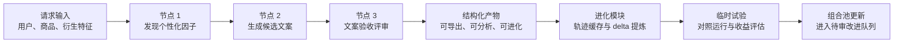
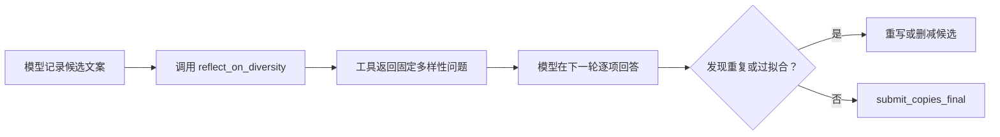
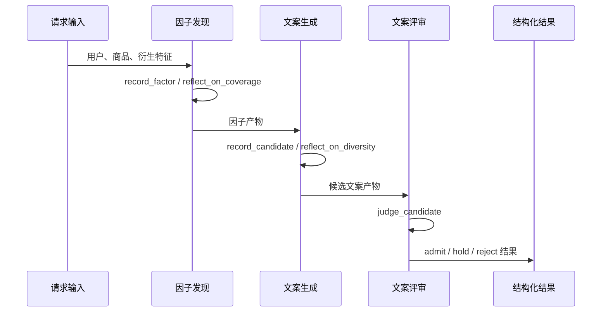
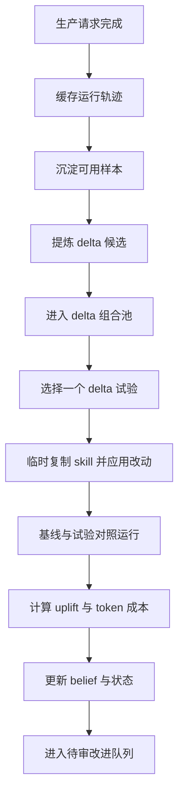

# 系统改进

## 1. 总体定位：从 LangGraph 式编排到我们的 Agent Loop

本系统的核心目标，是把“让大模型完成一个复杂任务”拆成可观察、可验证、可迭代的生产链路。它不是只给模型一段长提示词，然后等待一段文本结果；而是把模型运行过程约束在一组明确节点、明确输入、明确工具调用和明确产物结构中。

可以先用 LangGraph 与本系统的差异来理解整体设计。

| 对比维度 | LangGraph 常见思路 | 我们的系统思路 |
|---|---|---|
| 编排重点 | 用图结构描述节点、边、状态流转，适合表达复杂分支与多智能体协作 | 用顺序 DAG 承载生产主链路，每个节点内部由 agent loop 完成多轮工具调用 |
| 节点职责 | 节点通常是一段函数、模型调用或子图 | 节点是一个“带工具的技能执行单元”：系统提示词负责思考方式，工具负责结构化落盘 |
| 状态传递 | 共享或累计图状态，由边路由到下一个节点 | 每个节点只看到被裁剪后的输入视图，下游只读取上游产物，而不是继承全部上下文 |
| 模型输出 | 可返回文本、结构化对象或更新图状态 | 必须通过 `submit_*_final` 工具提交最终 JSON 产物，并由 Pydantic 模型校验 |
| 可控性 | 主要依赖节点函数、状态 schema 与条件边 | 依赖“系统提示词 + 严格工具 schema + handler 校验 + DAG 产物校验”的多层约束 |
| 适用重点 | 通用工作流、复杂分支、可视化状态机 | 高质量个性化文案生产、批量验收、可证据化进化 |

简单说，LangGraph 更像一套“搭建智能体图”的框架；我们的系统更像一条“可审计的生产流水线”。外层 DAG 决定生产顺序，内层 agent loop 决定每个节点如何思考、记录、反思和提交结果。

整体链路如下：

## 2. Agent Loop 的基本机制

每个生产节点的执行过程都遵循同一套机制：

1. 读取该节点对应的 `SKILL.md`，作为系统提示词。
2. 根据节点类型生成裁剪后的输入 payload。
3. 调用支持工具调用的模型接口。
4. 模型通过工具逐条记录中间结果。
5. 模型通过最终提交工具交付结构化 JSON。
6. 系统用 Pydantic 模型二次校验产物。
7. 成功产物进入下游节点；失败信息进入 trace 和验收记录。

这里最重要的区别是：系统提示词和工具不是同一类东西。

| 组成 | 作用 | 举例 |
|---|---|---|
| 系统提示词 / SKILL | 告诉模型如何思考、如何取舍、什么是好结果 | 因子要表达“可迁移的用户倾向”，文案要“翻转到用户视角”，评审要“先批注后判定” |
| 工具 schema | 告诉模型能提交哪些结构化动作，每个字段必须长什么样 | `record_factor`、`record_candidate`、`judge_candidate`、`submit_*_final` |
| 工具 handler | 在代码侧检查工具调用是否合规 | evidence path 是否存在、文案是否含数字、引用是否真的是原文子串 |
| Pydantic 产物模型 | 最终验收节点输出是否满足系统数据契约 | `FactorDiscoveryArtifact`、`CopyGenerationArtifact`、`PersonalizedCopyRubricArtifact` |

可以把 SKILL 理解为“判断标准和思考路线”，把工具理解为“模型必须填写的生产表单”。模型可以自由推理，但交付结果必须走这套表单，表单字段由代码校验。

### 反思工具的设计

系统里有两类反思方式：一种写在 SKILL 里，作为长期思考原则；另一种做成 `reflect_*` 工具，在运行时由模型主动调用。

反思工具的设计初衷，是把“请你反思一下”从一句容易被模型略过的提示，变成一次明确的运行事件。模型调用 `reflect_on_coverage` 或 `reflect_on_diversity` 后，工具不会替模型做判断，也不会返回质量分数，而是返回一组固定反思问题。模型必须在下一轮回答这些问题，再决定是否补充、重写或提交最终结果。

| 方式 | 机制 | 可观察性 | 对模型行为的影响 |
|---|---|---|---|
| 只在提示词里写“提交前请反思” | 反思要求混在长提示词里，模型可能读到但不显式执行 | 难以知道模型是否真的做过反思 | 更像软约束，容易被流畅生成过程吞掉 |
| 调用 `reflect_*` 工具 | 模型必须发起一次工具调用，工具返回固定问题，再进入下一轮推理 | trace 中能看到工具调用次数和调用位置 | 反思被插入执行流程，模型需要先回应问题再提交 |

举一个候选文案生成的例子。假设模型已经写出三条候选文案，但它们都以商品名开头，表达方式也都围绕同一种“商品很适合你”的角度。

如果反思只写在提示词里，模型可能在提交前简单想一句“我已经注意多样性”，然后直接 `submit_copies_final`。这时系统只能看到最终文案，无法判断它是否真的检查过“开头是否重复、锚点是否重复、是否能迁移给相似用户”。

如果使用 `reflect_on_diversity` 工具，流程会变成：

这样设计带来三点预期收益：

1. 反思动作可记录。验收 trace 时能看到模型是否调用过反思工具。
2. 反思问题稳定。不同请求面对的是同一组关键问题，减少模型临场发挥造成的漏检。
3. 反思发生在提交前。工具返回的问题会进入下一轮上下文，模型有机会修改已经记录的候选，而不是事后解释。

因此，反思工具不是额外的提示词装饰，而是 agent loop 中的一个控制点：它让“检查自己”变成可触发、可追踪、可复用的运行步骤。

## 3. 生产节点一：个性化因子发现

第一个节点的目标，是从用户、商品和衍生特征中发现“为什么这个用户可能会被这个商品打动”。它不直接写文案，而是为下游文案节点提供可迁移的说服角度。

### 输入视图

该节点可以看到较完整的请求场景，包括：

- 用户画像、行为、上下文；
- 目标商品列表；
- 每个商品的衍生特征；
- 当前推荐列表的上下文。

### 设计重点

这个节点不是把行为字段翻译成标签，而是提炼“关系”。例如，系统关注的不是“用户点过某个类目”，而是这个行为背后是否说明用户对某类体验、场景、风险或身份表达有稳定倾向。

节点产物中的关键字段包括：

| 字段 | 预期含义 |
|---|---|
| `factor_id` | 因子标识，供下游文案和评审追踪 |
| `user_side_signal` | 用户侧信号的简要描述 |
| `direction` | 因子的方向：用户到需求、商品到需求，或交叉关系 |
| `evidence_refs` | 因子的证据来源，必须指向输入 payload 中存在的字段 |
| `transferable_disposition` | 可迁移的用户倾向，是因子的核心 |
| `bridge` | 用户倾向如何连接到商品可见卖点 |
| `covers_product_ids` | 该因子覆盖的商品范围 |

### 工具约束

该节点主要使用：

- `record_factor`：记录一个因子，并校验证据路径存在；
- `reflect_on_coverage`：在角度覆盖不充分时触发固定反思问题，检查因子是否都挤在同一种用户信号或同一种说服路径上；
- `submit_factors_final`：提交最终因子列表。

验收时应看到：因子不是空泛标签，而是带证据、能连接商品、能指导文案、能迁移到相似用户的推理产物。

## 4. 生产节点二：候选文案生成

第二个节点读取上游因子，把每个有价值的说服角度落成短文案。它的任务不是解释模型为什么推荐，而是在推荐卡片上生成一句用户可感知、商品可承接的文案。

### 输入视图

这个节点不会直接继承完整用户状态，而是读取经过边界控制的输入：

- 上游因子；
- 商品事实；
- 商品衍生特征；
- 用户状态摘要；
- 与目标商品相关的用户信号；
- 候选生成策略。

这种设计让模型有足够信息写出个性化文案，同时把公开文案和私有行为痕迹隔离开。

### 设计重点

候选文案生成遵循几个关键原则：

| 原则 | 说明 |
|---|---|
| 用户视角 | 文案要表达“这个商品对用户有什么意义”，而不是重复商家卖点 |
| 单一锚点 | 一句话只抓一个具体可见元素，如场景、反应、对比、习惯或商品细节 |
| 短句节奏 | 文案适配推荐卡片，保持短、具体、有停顿 |
| 避免泄露 | 不把用户历史、搜索词、行为 token 暴露在文案中 |
| 避免数字价格钩子 | 不依赖折扣、价格、比例、数量等数字化表达撑起个性化 |

### 工具约束

该节点主要使用：

- `record_candidate`：记录一个候选文案，并执行多重结构校验；
- `reflect_on_diversity`：在提交前触发固定反思问题，检查候选开头、锚点、用户适配和可迁移性是否同质化；
- `submit_copies_final`：提交最终候选文案列表。

`record_candidate` 的校验尤其关键。它会检查：

| 校验项 | 预期结果 |
|---|---|
| 草稿一致性 | 最终文案必须来自模型自己列出的候选草稿 |
| 数字限制 | 文案不出现阿拉伯数字或作为数值使用的中文数字 |
| 长度限制 | 文案长度适合推荐卡片展示 |
| 锚点落地 | 商品锚点和关系锚点必须真实出现在文案中 |
| 用户历史隔离 | 文案只使用目标商品可承接的公开锚点，避免带出用户历史 token |

验收时应看到：候选文案短、具体、可展示，并且能追溯到上游因子，而不是生成一组泛化广告语。

## 5. 生产节点三：个性化文案评审

第三个节点负责把候选文案放回用户、商品和因子的上下文中验收。它不是简单给分，而是逐条判断候选文案是否满足上线前的质量底线。

### 输入视图

评审节点读取：

- 上游因子；
- 候选文案；
- 商品事实；
- 用户状态摘要；
- 与目标商品相关的用户信号。

它的判断对象是“候选文案是否可靠地承接了个性化因子”，而不是单纯评价一句话是否好听。

### 七个二元验收轴

| 轴 | 关注问题 | 结果影响 |
|---|---|---|
| `factor_fit` | 文案是否承接了上游因子的说服角度 | 失败则拒绝 |
| `persuasion_specificity` | 文案是否有可引用的具体锚点 | 失败则拒绝 |
| `user_perspective` | 文案是否从用户视角表达价值 | 失败则拒绝 |
| `welcome_address` | 文案是否避免直接标签化用户身份 | 失败则拒绝 |
| `no_system_introspection` | 文案是否避免暴露推荐系统或模型推理 | 失败则拒绝 |
| `no_price_or_number_hook` | 文案是否避免数字、价格、折扣作为主要钩子 | 失败则拒绝 |
| `retrieval_portability` | 文案是否能迁移给相似用户，而不是绑定单个用户历史 | 单独失败则暂挂 |

评审节点采用“先批注、后判定”的方式。每个轴都要先写出依据，再给出 `pass` 或 `fail`。如果引用文案片段，引用内容必须是候选文案里的真实子串。

### 输出结果

每条候选文案最终进入三种状态之一：

| 状态 | 含义 |
|---|---|
| `admit` | 可进入后续导出或离线缓冲 |
| `hold` | 主体合格，但迁移性仍需谨慎 |
| `reject` | 触发核心质量底线，作为不进入合格集的候选 |

验收时应看到：评审不是模型自评打分，而是可追溯的二元判断；每个拒绝或暂挂都有明确轴和文字依据。

## 6. 三个生产节点的协作关系

三个节点形成一条递进链：

这条链路的关键收益是：每个节点只做一种判断，下游只能消费上游已经结构化的结果。这样可以减少长上下文里常见的“想到哪写到哪”，让每次失败都能定位到具体节点、具体工具调用、具体字段。

## 7. 进化模块：从运行轨迹到可验证改进

进化模块的目标，是让系统从真实运行轨迹中提炼可测试的改进建议，并通过对照试验更新对这些建议的信任程度。

它不是让模型直接改生产提示词，而是把改动拆成几个阶段：

## 8. 轨迹缓存与样本沉淀

一次请求运行结束后，系统会记录紧凑轨迹，而不是保存完整私有上下文。轨迹记录面向后续分析，包含：

| 信息 | 用途 |
|---|---|
| 请求与场景标识 | 追踪样本来源 |
| 各节点产物路径 | 回看因子、候选、评审结果 |
| 工具调用次数 | 衡量运行复杂度 |
| token 使用 | 衡量成本 |
| 试验 delta 标识 | 追踪某次改动是否参与运行 |
| 失败类别 | 区分结构问题、模型问题、试验问题 |
| 质量与成本分桶 | 支持后续抽样和多样性保留 |

缓存后还会做“沉淀”处理：

1. 过滤带有私有轨迹字段的记录。
2. 按结果形态去重，避免同类样本淹没分析池。
3. 按成功、失败、质量、成本等维度轮转选样。
4. 控制样本数量，保持人工和机器分析可承受。

验收时应看到：进化分析依赖的是可追踪轨迹和结构化产物，而不是模型事后自我解释。

## 9. Delta 提炼：把经验变成可试验改动

进化模块使用独立的 `distill-skill-deltas` 技能来读取一条完整轨迹，并提出 delta。这里的 delta 是一个“小而可试验的技能改动”，不是整段提示词重写。

一个合格 delta 包含：

| 字段 | 含义 |
|---|---|
| `delta_id` | 改动标识 |
| `target_skill` | 目标 skill 文件路径 |
| `change_type` | 修改已有 skill 或新增实验 skill |
| `observation` | 从轨迹中观察到的可复用模式 |
| `proposed_change` | 建议加入或调整的最小指令 |
| `evidence_refs` | 支撑该观察的证据引用 |
| `applicable_surface` | 适用的场景表面 |
| `failure_types` | 相关失败类型 |

该阶段的工具包括：

- `record_delta_observation`：记录轨迹观察；
- `record_delta_change`：记录具体改动建议；
- `submit_delta_distillation_final`：提交 delta 列表。

工具会校验三类关键约束：

| 约束 | 预期效果 |
|---|---|
| 必须有证据引用 | delta 来自轨迹，而不是空想 |
| 目标 skill 路径必须规范 | delta 能被运行时解析和试验 |
| 禁止自评指标字段 | 置信度由后续试验计算，而不是模型自己给分 |

验收时应看到：delta 是有证据、可定位、可单独试验的小改动。

## 10. Delta 组合池与选择策略

所有 delta 会进入组合池。组合池不是简单列表，而是带有试验统计的状态表。

每一行 delta 都维护：

| 指标 | 含义 |
|---|---|
| `sample_count` | 已试验次数 |
| `success_count` / `failure_count` | 成功与失败次数 |
| `belief_alpha` / `belief_beta` | 基于试验结果更新的后验计数 |
| `token_cost_delta_sum` | 累计 token 成本变化 |
| `status` | 当前生命周期状态 |

选择试验 delta 时，系统会综合考虑：

- delta 是否仍处于实验状态；
- 当前请求表面是否与 delta 适用范围重合；
- 最近生产失败率；
- token 预算压力；
- 当前生产并发压力；
- delta 过往试验是否足够；
- delta 当前 belief 是否有正向信号。

预期效果是：系统会优先探索样本少但有潜力的 delta，同时在生产压力高、失败率高、成本压力高时降低试验概率。

## 11. 临时应用与对照测试

当某个 delta 被选中试验时，系统会复制一份 skill 根目录到临时工作区，再在临时副本上应用改动。运行时只读取这份临时 skill，生产 skill 文件保持稳定。

试验运行包含两类路径：

| 路径 | 用途 |
|---|---|
| baseline | 使用当前 skill 运行请求，作为对照 |
| trial | 使用应用 delta 后的临时 skill 运行同一请求 |

系统会对比两条路径的结果，形成 uplift：

| 指标 | 含义 |
|---|---|
| `success_lift` | 试验相对基线的成功变化 |
| `token_cost_delta` | 试验相对基线的 token 成本变化 |
| `behavioral_metric_lift` | 行为指标变化，如因子数量、候选草稿数量、delta 多样性等 |
| `is_positive` | 在质量和成本约束下是否构成正向试验 |

验收时应看到：改进效果来自同一请求上的对照结果，而不是模型自我判断；质量提升清晰，成本也在预算容忍范围内。

## 12. 实验验证中的评估口径校准

在设计验收方案时，我们也验证过一种看似直接、但实际偏差很大的评估方式：让大模型扮演用户，对带文案的商品列表打“点击欲望”分。

这个实验的大致做法是：

1. 先把生成出的文案放入候选缓存池。
2. 对一批用户做聚类，挑选有代表性的用户画像。
3. 让大模型扮演这些用户，阅读带文案的商品清单。
4. 要求模型判断每个用户看到清单后的点击欲望。

这个方案的直觉是合理的：如果个性化文案真的有效，模拟用户应该更愿意点击对应商品。但实测后发现，这类 role-play 打分不能可靠代表真实推荐场景。

核心原因在于注意力分布不一致。真实场景下，用户看到的是一个视觉商品列表：图片、商品标题、价格、品牌、位置、熟悉度都会同时争夺注意力，文案只占其中很小一部分。而文字版本的商品列表会把文案放大成主要信息，模型扮演用户时也会自然把注意力集中到文案本身。

因此，模拟结果容易发生反向偏置：加了文案后，模型不再像真实用户那样先看商品整体，而是转去评价“这句文案好不好”。当文案不够强、过于刻意，或与商品主信息相比显得突兀时，模拟用户反而更倾向于不点击。这里得到的低点击欲望，并不一定说明商品吸引力下降，而是说明 role-play 评估把注意力从商品转移到了文案。

可以把这个失败设计总结成下表：

| 评估设计 | 预期能回答的问题 | 实测暴露的问题 | 对当前验收的启发 |
|---|---|---|---|
| LLM 扮演用户，对文字商品清单打点击欲望 | 文案是否提升用户点击意愿 | 文案在文字输入中被过度放大，模型主要评价文案好坏，而不是模拟真实视觉浏览 | 不把 role-play 点击分作为主验收指标 |
| 结构化文案验收 | 文案是否承接因子、是否安全、是否可迁移、是否适合展示 | 更接近文案本身的可控质量边界 | 作为离线质量门槛 |
| 真实或近真实场景证据 | 文案放进真实推荐位后是否有效 | 需要真实曝光、点击或更接近视觉界面的实验支持 | 作为产品效果判断的最终依据 |

这个结论反过来强化了当前系统的验收思路：离线阶段先验收“文案是否合格”，不要过早让 LLM 模拟完整用户点击；真正的点击效果需要依赖更接近真实界面的实验，或者真实线上/离线曝光数据。也就是说，LLM 更适合帮助我们检查文案结构、证据链和安全边界，不适合作为纯 role-play 的点击率裁判。

## 13. Delta 筛选与状态流转

试验结果会更新组合池中的统计信息。系统用成功次数、试验次数和成本变化判断 delta 的状态。

| 状态 | 含义 |
|---|---|
| `experimental` | 正在收集试验证据 |
| `ready_for_review` | 试验信号达到待审门槛 |
| `held` | 信号需要继续观察或暂缓 |
| `rejected` | 试验证据显示不适合继续推进 |

进入 `ready_for_review` 的核心条件包括：

- 试验样本数量达到门槛；
- Wilson 下置信界达到推广阈值；
- token 成本的高分位增长在可接受范围内。

这让 delta 筛选具备统计约束：少量偶然成功不会直接进入改进队列，成本过高的成功也会被控制。

