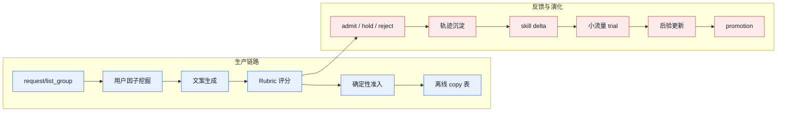
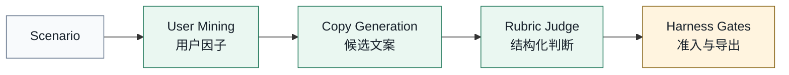
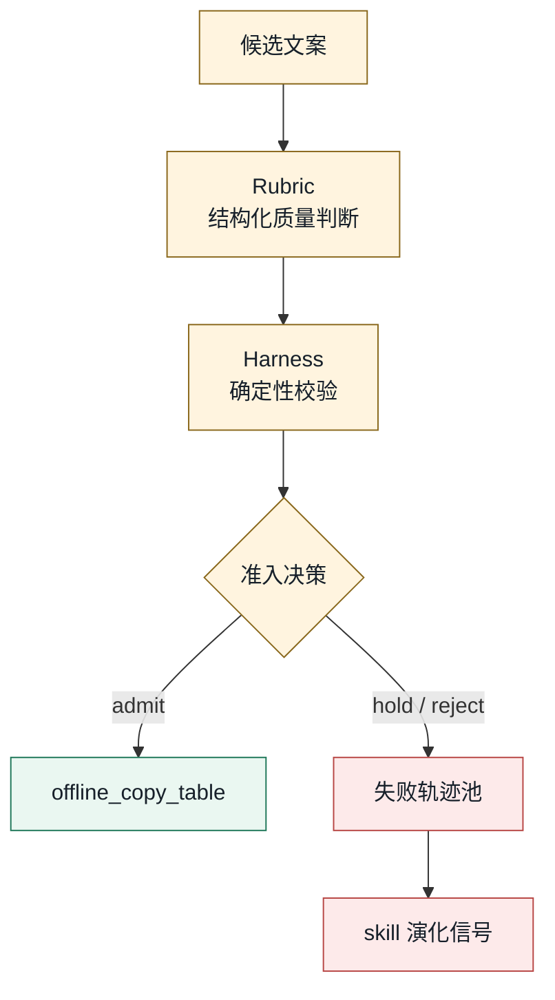
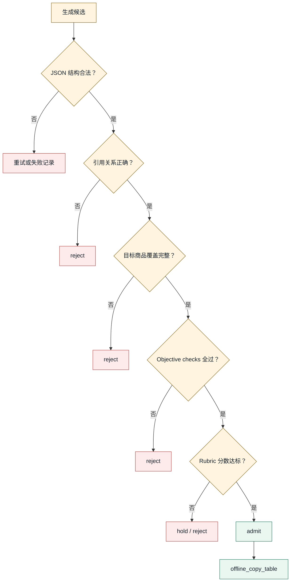
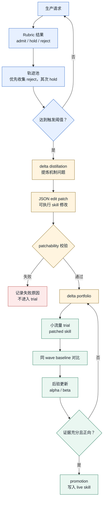

# VIP COPY

## 面向电商推荐的个性化文案与可进化 Skill Harness

VIP COPY 关注的不只是“让大模型写一句文案”，而是如何让文案系统具备两种长期能力：

- **个性化**：理解不同用户为什么会被不同表达打动。
- **可进化**：从真实生产反馈中持续改进文案机制。

`request/list_group` · `User Factor IR` · `Rubric Signal` · `Skill Delta Trial`

---

## 1. 问题重定义

普通的 LLM 文案系统通常把问题理解为：给定一个商品和一段用户信息，让模型生成一句看起来不错的文案。  
VIP COPY 的问题定义更进一步：在一次推荐曝光中，为一组商品生成可入库、可复用、可持续改进的个性化文案资产。

| 维度 | 普通文案生成 | VIP COPY |
|---|---|---|
| 目标 | 写出一句顺畅文案 | 生产可服务的个性化文案资产 |
| 用户建模 | 把用户标签放进 prompt | 抽象用户动机，再绑定商品事实 |
| 生成单位 | 单个商品 | 一次曝光请求中的商品列表 |
| 质量判断 | 依赖单次模型输出 | 生成、rubric、确定性准入共同决定 |
| 改进方式 | 人工修改 prompt | 从生产反馈中学习 skill delta |

这里的关键不是“过程记录得更完整”，而是让系统形成一个闭环：  
**个性化生成带来反馈，反馈再推动生成机制进化。**

---

## 2. 两个核心能力

VIP COPY 的核心优势可以压缩成两个词：**个性化** 和 **可进化**。  
前者决定当前这次推荐文案是否写得对，后者决定系统是否能随着生产数据逐步变好。

| 能力 | 解决的问题 | 系统机制 |
|---|---|---|
| 个性化 | 文案不能只讲商品卖点，还要解释“为什么这个用户会在意” | `User Factor IR` 将用户行为压缩成可迁移动机 |
| 可进化 | prompt 不应该是静态手工产物，而应该能从反馈中更新 | `Skill Delta Trial` 将机制改动放入小流量验证 |

这两个能力并不是并列摆放的功能点，而是前后相连的系统逻辑：

```text
用户行为 -> 用户动机 -> 个性化文案 -> 质量反馈 -> skill delta -> 更好的个性化机制
```

---

## 3. 个性化的基本单元：request/list_group

推荐场景里，用户看到的是一组商品，而不是一个孤立商品。  
因此 VIP COPY 不以单个 item 作为最小处理单元，而是以 `request/list_group` 作为基本语义单元。

```text
request/list_group = 同一用户上下文 + 同一次曝光列表 + 多个合规商品
```

| 如果逐商品生成 | 如果按 request/list_group 生成 |
|---|---|
| 每个商品都重复挖用户画像 | 用户因子只挖一次，可复用 |
| 文案角度容易重复 | 同组商品可以形成差异化表达 |
| 很难判断候选之间是否同质 | rubric 可以比较组内 distinctiveness |
| 个性化容易变成硬贴用户标签 | 用户动机和商品列表能一起建模 |

最终交付给下游的离线表仍然保持轻量：

| request_id | user_id | item_id | copy |
|---|---|---|---|

个性化不是给每个商品单独贴上用户标签，而是让一次曝光列表整体适配用户动机。

---

## 4. 系统总览

VIP COPY 由两条链路组成：一条负责生产个性化文案，一条负责让生产反馈进入下一轮机制改进。
这两条链路不是并列模块，而是前后相扣：生产链路产生文案和质量结果，演化链路把这些结果转化为 skill 的改进方向。



生产链路从 `request/list_group` 出发，先抽象用户因子，再生成文案，最后经过 rubric 与确定性准入进入离线表。  
反馈与演化链路从 rubric 结果开始，`admit / hold / reject` 不只是结果标签，也会沉淀为轨迹，用来提出、验证和推广新的 skill delta。

因此，VIP COPY 不是“一次请求调用三次模型”这么简单。它更像一个小型训练系统：每次生产都会留下反馈，每轮反馈都可能改变下一版生成机制。

---

## 5. 三节点生产 DAG

生产路径只保留三个 LLM 节点。  
这三个节点都走 JSON mode，不使用工具；节点之间只通过 typed artifact 传递状态。



| 节点 | 主要输入 | 主要输出 | 作用 |
|---|---|---|---|
| User Mining | 用户历史与行为信号 | 用户个性化因子 | 把行为压缩成动机 |
| Copy Generation | 用户因子、商品事实、派生特征 | 候选文案 | 让商品事实承接用户动机 |
| Rubric Judge | 候选文案与上下文 | 结构化评分 | 将文案质量转成反馈信号 |

这条 DAG 的设计重点是“拆开不可控的生成过程”。  
用户因子挖掘负责解决“用户为什么会在意”，文案生成负责解决“商品如何承接这个动机”，rubric 判断负责解决“这条表达是否真的可用”。  
三步之间有明确的中间产物，因此后续失败分析也能定位到具体环节，而不是只看到一条最终文案。

---

## 6. User Factor IR：从行为到动机

用户历史通常是高维、稀疏、带噪声的行为记录。  
如果直接把这些记录塞给模型，文案容易变成对历史行为的复述，也容易泄露不该出现在公开文案里的信息。

VIP COPY 先把用户行为压缩成 `User Factor IR`：

| 字段 | 含义 |
|---|---|
| `signal_basis` | 用户行为中可见的信号模式 |
| `need_or_pain` | 可迁移的需求或痛点 |
| `scene_trigger` | 可能触发购买的使用场景 |
| `buying_heuristic` | 用户可能依赖的购买判断 |
| `expression_hooks` | 可用于文案表达的切入点 |

一个好的用户因子不是标签，而是“动机解释”。

```text
不理想：用户最近点击过某品牌，所以推荐这个。
更合理：用户可能偏好低决策成本、口碑明确、日常可用的商品。
```

这一步是个性化能力的核心：  
它把私有行为轨迹转成可迁移、可复用、可服务相似用户的动机表示。

---

## 7. 文案生成：动机 × 商品事实

文案生成节点不是简单地把用户因子改写成短句。  
它需要判断当前商品是否真的能承接这个用户动机。

| 输入 | 在生成中的作用 |
|---|---|
| 用户因子 | 说明用户为什么可能在意 |
| 商品事实 | 说明商品凭什么承接这个动机 |
| 派生特征 | 补充价格、品牌、类目、口碑等可用信号 |
| 列表上下文 | 避免同组商品文案角度重复 |

生成候选文案时，每条 candidate 都保留结构化绑定：

| 字段 | 作用 |
|---|---|
| `candidate_id` | 稳定定位候选 |
| `product_id` | 绑定当前目标商品 |
| `source_user_factor_id` | 说明文案来自哪个用户动机 |
| `product_binding` | 说明文案如何绑定商品价值 |
| `fact_binding` | 说明使用了哪些可见事实 |

好文案不是“更会夸”，而是完成一件事：  
**让用户动机和商品事实之间形成可信连接。**

---

## 8. 质量信号与系统准入

文案质量不能只停留在模型的一句“好/不好”。  
VIP COPY 把质量判断拆成三层：先由 rubric 产生结构化反馈，再由 harness 做确定性校验，最后通过准入漏斗决定文案是否进入离线表。



Rubric 的第一层是硬规则：只要文案触碰隐私轨迹、未经支持的事实宣称或结构性问题，就直接进入 reject。  
通过硬规则后，系统才看 7 个质量轴。这样做能避免一个常见问题：模型给出一个“看似不错”的总评，但文案本身并不适合发布。

Harness 的作用是把模型输出变成系统状态。  
LLM 可以抽象用户动机、生成候选、给出 rubric 判断；但 JSON 结构、product/factor 引用、候选覆盖、rubric 完整性和最终 admission 都由代码确定。这样既保留 LLM 的语义能力，又不会让关键工程状态由模型自说自话。

| 层次 | 做什么 | 结果 |
|---|---|---|
| Rubric 硬规则 | 检查隐私轨迹、事实宣称、发布安全 | 明确 reject |
| Rubric 质量轴 | 评价动机贴合、商品价值、转化牵引、文案表达、差异性、场景感、利益清晰度 | 形成结构化分数 |
| Harness 校验 | 检查 schema、引用关系、目标商品覆盖、judgment 完整性 | 推导最终 admission |
| 离线导出 | 只导出满足 objective checks 和分数门槛的文案 | 进入业务表 |



这个漏斗把“模型生成了什么”和“业务能不能用”分开处理。  
前几层检查结构和引用关系，保证候选能对齐真实商品和真实用户因子；后几层检查发布安全与质量分数，保证文案进入业务表之前已经经过统一标准。

被挡下来的 `hold` 和 `reject` 并不会被简单丢掉。  
它们是系统最有价值的训练样本之一，因为它们暴露了当前 skill 机制的薄弱点。

---

## 9. Skill 进化机制：从失败轨迹到可验证 delta

VIP COPY 的进化机制不是让模型“反思一下 prompt 怎么改”。  
它更接近训练一个大模型外部的策略层：生产流量不断产生质量反馈，系统从反馈中提炼可执行的 skill delta，再用小流量实验判断这个 delta 是否真的改善了生成机制。

这里没有更新大模型权重，更新的是 skill/prompt 中的机制性规则。  
这些规则决定模型如何理解用户因子、如何把动机绑定到商品事实、如何避免空泛表达。它们就像外部策略参数，可以被生产反馈持续校正。

| 模型参数训练 | VIP COPY 的 skill 进化 |
|---|---|
| 训练样本 | 生产中的 admit / hold / reject 轨迹 |
| 参数 | skill / prompt 中可改写的机制规则 |
| 优化方向 | 从失败轨迹中蒸馏出的 delta proposal |
| 奖励信号 | rubric score uplift、admission 变化、token cost |
| 验证集 | 同 wave baseline 与小流量 trial |
| checkpoint | promoted skill 与 archived previous bytes |

### 进化流程



这个流程有三个关键约束。

第一，触发不是逐条请求发生的。系统会先积累一批 reject/hold 轨迹，避免被单个噪声样本牵着走。轨迹里保留了用户因子、候选文案、rubric judgment、usage 和因子-文案关联，因此系统可以判断问题出在用户动机抽象、商品事实绑定，还是文案表达机制。

第二，delta 必须是可执行 patch。进化 skill 不能只输出“增强场景感”这样的建议，而要给出能应用到目标 skill 文件的 JSON edit。patchability 校验会先在临时 skill workspace 中验证修改能否稳定应用，不能应用的 delta 不会进入 trial。

第三，delta 必须经过线上小流量验证。系统不会因为某个失败案例看起来有道理，就直接修改 live skill。trial 使用少量 production request slot 运行 patched skill，同时保留同一 wave 中相近请求的正式版本作为 baseline。

### Trial 如何判断 delta 是否有效

trial 的比较对象不是一个抽象平均值，而是同一批生产流量里的正式版本结果。系统会按类目、目标商品数量、用户信号密度等特征寻找 baseline reference，再比较 patched skill 的 rubric 均分。

```text
score_delta = trial_mean_score - baseline_mean_score

score_delta > 0: belief_alpha += 1
score_delta <= 0: belief_beta  += 1
```

后验更新让系统不会因为一次偶然成功就 promotion，也不会因为一次失败就立刻放弃。每个 delta 都通过多次 trial 积累 `alpha / beta`，直到证据足够清楚：正向的 delta 进入 ready/promotion，信号不足的 delta held，负向的 delta rejected。

### Case：从“场景质感弱”到可验证 delta

下面这个例子展示系统如何把一类失败现象转成可测试的机制改动。

| 阶段 | 系统看到什么 | 系统做什么 |
|---|---|---|
| 触发 | 多条文案被 rubric 判为 hold/reject，常见问题是只堆叠“高口碑”“大牌”“热销”等抽象卖点，`scene_texture` 或 `benefit_clarity` 偏弱 | 将这些 request 轨迹加入同一批 distillation 输入 |
| 提炼 | 失败不是某一个商品文案写错，而是生成机制缺少“场景质感”约束 | 生成面向 `personalized-copy-generation` 的 delta proposal |
| 形成 delta | delta 不改具体文案，而是修改 skill 中的生成方法：要求文案用可见商品事实承接一个具体使用场景，避免只堆抽象背书词 | 输出 JSON edit patch，并绑定 evidence refs |
| 应用 | patch 先应用到临时 skill root，不直接修改正式 skill | 通过 patchability 校验后进入 delta portfolio |
| 测试 | 在后续 production wave 中抽取少量 request slot 使用 patched skill | 与同 wave 正式版本 baseline 比较 rubric 均分和 token 成本 |
| 更新 | 如果 patched skill 在相近请求上带来更高的平均 rubric 分，记为一次 success | 更新 `belief_alpha`；否则更新 `belief_beta` |
| 推广 | 多次 trial 后，如果后验显示稳定正向，delta 才可能 promotion | 写入 live skill，并归档旧版本以便回滚 |

这个 case 的核心不是“把某条坏文案改好”，而是识别出一个可复用的机制缺陷：文案生成过度依赖抽象卖点，缺少能让用户感知到使用场景的表达。  
delta 解决的是机制层问题，因此它有机会在后续同类 request 中持续产生收益。
